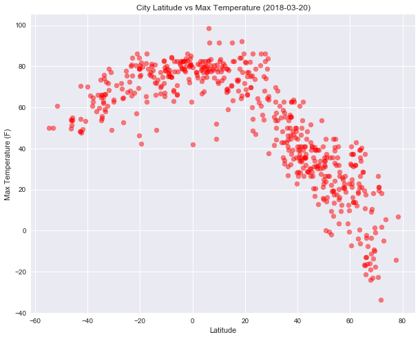
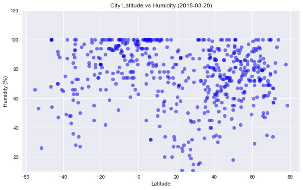
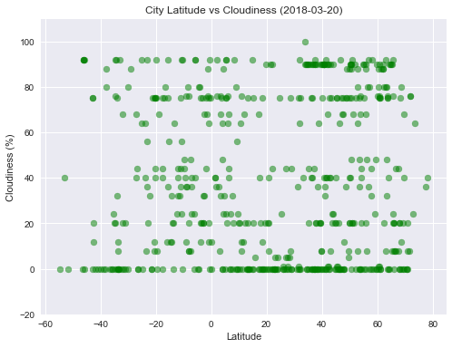
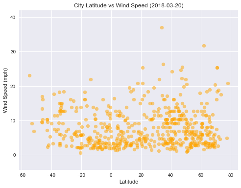

# Analysis
* Observed Trend 1:
    Temperatures dip down (Climate get more colder) as we move up towards the northern hemisphere, 
    compared to the temperatures as we move down towards southern hemisphere.
* Observed Trend 2:
    The warmer the temperatures are the more humid the cities are.  Looking at the two plots "latitude vs temperature"
    and "latitude vs humidity", the cooler the temperatues are, the humidity numbers tend to be a little lower.
* Observed Trend 3:
    A look at all the trends plotted, tell us that Latitude has direct affect on the temperatures and not so much on
    humidity, cloudiness and windspeed directly. These 3 (humidity, cloudiness and windspeed) are more directly 
    related to temperatures, which we can have more concluded results if we were to plot these 3 variables against 
    temperatures rather than against Latitude.


```python
# import dependencies
import random # random to generate random latitude and longitudes
import pandas as pd # pandas library
import time 
import seaborn as sns # seaborn library to set the aesthetics for the graphs
import matplotlib.pyplot as plt # for creating/plotting graphs
import numpy as np
from datetime import datetime
import openweathermapy as owm
```


```python
import csv
```

## Generate cities list


```python
# citypy library - to Look up for city names with geo-coordinates
from citipy import citipy 
cities = []

while len(cities)<600:
    x = (random.choice(range(-90,90))) # randomly generate numbers in range -90 & 90 for latitude
    y = (random.choice(range(-180,180))) # randomly generagte numbers in range -180 & 180 for longitude
    city = citipy.nearest_city(x,y).city_name # look up city to match the lat & long randomly generated
    if city not in cities:
        cities.append(city)
```

* Number of unique cities generted


```python
len(cities)
```


    600


## Perform API Calls

* Initialize WeatherPy Data Frame to store weather data for the cities generated.

```python
# import API Key from config file
from config import api_key
# Create settings dictionary with information we're interested in
settings = {"units": "imperial", "appid": api_key}

# Initialize data frame to store data from API calls
WeatherPy_df =pd.DataFrame(columns = ["City","Cloudiness", "Country",
                                    "Date", "Max Temp", "Wind Speed", 
                                    "Lat","Lng", "Humidity"])
```

* Perform API calls and send retrieved data to the WeatherPy data frame


```python
count = 1 # counter to count the number of calls to API
err = 0 # error count to record how many cities the API responds back with no data.
sets = 0 # counter to count the number of call sets
index = 0 # index for the data frame WeatherPy data frame
#Get current time
t0 =time.time()
print(f'Beginning Data Retrieval \n ........................')
for city in cities:
    try:
        city1 = city.replace(" ", "%20") # remove space in city name so the URL retrieved is not broken.
        print(f'Processing Record {count} of Set {sets} | {city}' )
        print(f'{owm.BASE_URL}weather?q={city1}&units=imperial&APPID={api_key}')
        city_stats = owm.get_current(city, **settings)
        WeatherPy_df.set_value(index, "City", city_stats["name"])
        WeatherPy_df.set_value(index, "Cloudiness", city_stats("clouds.all"))
        WeatherPy_df.set_value(index, "Country", city_stats("sys.country"))
        WeatherPy_df.set_value(index, "Date", city_stats("dt"))
        WeatherPy_df.set_value(index, "Max Temp", city_stats("main.temp_max"))
        WeatherPy_df.set_value(index, "Wind Speed", city_stats("wind.speed"))
        WeatherPy_df.set_value(index, "Lat", city_stats("coord.lat"))
        WeatherPy_df.set_value(index, "Lng", city_stats("coord.lon"))
        WeatherPy_df.set_value(index, "Humidity", city_stats("main.humidity"))
        index = index +1 
    except Exception as e:
        print(e)
        err= err+1
    count = count+1
    if count == 51: # loop to limit 50 API calls per minute. The OpenWeatherMap API limit is 60 calls/min
        t1=time.time()
        count = 1 
        sets = sets+1
        time.sleep(60-(t1-t0))
        t0=time.time()

print("end of stats loop")
print(f'Could not get data for {err} cities')

```

    Beginning Data Retrieval 
     ........................
    Processing Record 1 of Set 0 | ushuaia
    http://api.openweathermap.org/data/2.5/weather?q=ushuaia&units=imperial&APPID=550c1a2896ccc20ae6bf4af57366fea4
    Processing Record 2 of Set 0 | bambous virieux
    http://api.openweathermap.org/data/2.5/weather?q=bambous%20virieux&units=imperial&APPID=550c1a2896ccc20ae6bf4af57366fea4
    Processing Record 3 of Set 0 | parfino
    http://api.openweathermap.org/data/2.5/weather?q=parfino&units=imperial&APPID=550c1a2896ccc20ae6bf4af57366fea4
    Processing Record 4 of Set 0 | boguchany
    http://api.openweathermap.org/data/2.5/weather?q=boguchany&units=imperial&APPID=550c1a2896ccc20ae6bf4af57366fea4
    Processing Record 5 of Set 0 | mataura
    http://api.openweathermap.org/data/2.5/weather?q=mataura&units=imperial&APPID=550c1a2896ccc20ae6bf4af57366fea4
    Processing Record 6 of Set 0 | ambon
    http://api.openweathermap.org/data/2.5/weather?q=ambon&units=imperial&APPID=550c1a2896ccc20ae6bf4af57366fea4
    Processing Record 7 of Set 0 | faya
    http://api.openweathermap.org/data/2.5/weather?q=faya&units=imperial&APPID=550c1a2896ccc20ae6bf4af57366fea4
    Processing Record 8 of Set 0 | barrow
    http://api.openweathermap.org/data/2.5/weather?q=barrow&units=imperial&APPID=550c1a2896ccc20ae6bf4af57366fea4
    Processing Record 9 of Set 0 | atuona
    http://api.openweathermap.org/data/2.5/weather?q=atuona&units=imperial&APPID=550c1a2896ccc20ae6bf4af57366fea4
    Processing Record 10 of Set 0 | mackenzie
    http://api.openweathermap.org/data/2.5/weather?q=mackenzie&units=imperial&APPID=550c1a2896ccc20ae6bf4af57366fea4
    Processing Record 11 of Set 0 | hermanus
    http://api.openweathermap.org/data/2.5/weather?q=hermanus&units=imperial&APPID=550c1a2896ccc20ae6bf4af57366fea4
    Processing Record 12 of Set 0 | saint-philippe
    http://api.openweathermap.org/data/2.5/weather?q=saint-philippe&units=imperial&APPID=550c1a2896ccc20ae6bf4af57366fea4
    Processing Record 13 of Set 0 | kralendijk
    http://api.openweathermap.org/data/2.5/weather?q=kralendijk&units=imperial&APPID=550c1a2896ccc20ae6bf4af57366fea4
    Processing Record 14 of Set 0 | new norfolk
    http://api.openweathermap.org/data/2.5/weather?q=new%20norfolk&units=imperial&APPID=550c1a2896ccc20ae6bf4af57366fea4
    Processing Record 15 of Set 0 | mason city
    http://api.openweathermap.org/data/2.5/weather?q=mason%20city&units=imperial&APPID=550c1a2896ccc20ae6bf4af57366fea4
    Processing Record 16 of Set 0 | hilo
    http://api.openweathermap.org/data/2.5/weather?q=hilo&units=imperial&APPID=550c1a2896ccc20ae6bf4af57366fea4
    Processing Record 17 of Set 0 | grindavik
    http://api.openweathermap.org/data/2.5/weather?q=grindavik&units=imperial&APPID=550c1a2896ccc20ae6bf4af57366fea4
    Processing Record 18 of Set 0 | manokwari
    http://api.openweathermap.org/data/2.5/weather?q=manokwari&units=imperial&APPID=550c1a2896ccc20ae6bf4af57366fea4
    Processing Record 19 of Set 0 | manggar
    http://api.openweathermap.org/data/2.5/weather?q=manggar&units=imperial&APPID=550c1a2896ccc20ae6bf4af57366fea4
    Processing Record 20 of Set 0 | kapaa
    http://api.openweathermap.org/data/2.5/weather?q=kapaa&units=imperial&APPID=550c1a2896ccc20ae6bf4af57366fea4
    Processing Record 21 of Set 0 | constantine
    http://api.openweathermap.org/data/2.5/weather?q=constantine&units=imperial&APPID=550c1a2896ccc20ae6bf4af57366fea4
    Processing Record 22 of Set 0 | cananeia
    http://api.openweathermap.org/data/2.5/weather?q=cananeia&units=imperial&APPID=550c1a2896ccc20ae6bf4af57366fea4
    Processing Record 23 of Set 0 | rungata
    http://api.openweathermap.org/data/2.5/weather?q=rungata&units=imperial&APPID=550c1a2896ccc20ae6bf4af57366fea4
    HTTP Error 404: Not Found
    Processing Record 24 of Set 0 | taolanaro
    http://api.openweathermap.org/data/2.5/weather?q=taolanaro&units=imperial&APPID=550c1a2896ccc20ae6bf4af57366fea4
    HTTP Error 404: Not Found
    Processing Record 25 of Set 0 | bowen
    http://api.openweathermap.org/data/2.5/weather?q=bowen&units=imperial&APPID=550c1a2896ccc20ae6bf4af57366fea4
    Processing Record 26 of Set 0 | avarua
    http://api.openweathermap.org/data/2.5/weather?q=avarua&units=imperial&APPID=550c1a2896ccc20ae6bf4af57366fea4
    Processing Record 27 of Set 0 | jamestown
    http://api.openweathermap.org/data/2.5/weather?q=jamestown&units=imperial&APPID=550c1a2896ccc20ae6bf4af57366fea4
    Processing Record 28 of Set 0 | kapoeta
    http://api.openweathermap.org/data/2.5/weather?q=kapoeta&units=imperial&APPID=550c1a2896ccc20ae6bf4af57366fea4
    HTTP Error 404: Not Found
    Processing Record 29 of Set 0 | rikitea
    http://api.openweathermap.org/data/2.5/weather?q=rikitea&units=imperial&APPID=550c1a2896ccc20ae6bf4af57366fea4
    Processing Record 30 of Set 0 | eura
    http://api.openweathermap.org/data/2.5/weather?q=eura&units=imperial&APPID=550c1a2896ccc20ae6bf4af57366fea4
    Processing Record 31 of Set 0 | muros
    http://api.openweathermap.org/data/2.5/weather?q=muros&units=imperial&APPID=550c1a2896ccc20ae6bf4af57366fea4
    Processing Record 32 of Set 0 | gizo
    http://api.openweathermap.org/data/2.5/weather?q=gizo&units=imperial&APPID=550c1a2896ccc20ae6bf4af57366fea4
    Processing Record 33 of Set 0 | umzimvubu
    http://api.openweathermap.org/data/2.5/weather?q=umzimvubu&units=imperial&APPID=550c1a2896ccc20ae6bf4af57366fea4
    HTTP Error 404: Not Found
    Processing Record 34 of Set 0 | mahebourg
    http://api.openweathermap.org/data/2.5/weather?q=mahebourg&units=imperial&APPID=550c1a2896ccc20ae6bf4af57366fea4
    Processing Record 35 of Set 0 | yining
    http://api.openweathermap.org/data/2.5/weather?q=yining&units=imperial&APPID=550c1a2896ccc20ae6bf4af57366fea4
    Processing Record 36 of Set 0 | geraldton
    http://api.openweathermap.org/data/2.5/weather?q=geraldton&units=imperial&APPID=550c1a2896ccc20ae6bf4af57366fea4
    Processing Record 37 of Set 0 | puerto ayora
    http://api.openweathermap.org/data/2.5/weather?q=puerto%20ayora&units=imperial&APPID=550c1a2896ccc20ae6bf4af57366fea4
    Processing Record 38 of Set 0 | havre-saint-pierre
    http://api.openweathermap.org/data/2.5/weather?q=havre-saint-pierre&units=imperial&APPID=550c1a2896ccc20ae6bf4af57366fea4
    Processing Record 39 of Set 0 | amderma
    http://api.openweathermap.org/data/2.5/weather?q=amderma&units=imperial&APPID=550c1a2896ccc20ae6bf4af57366fea4
    HTTP Error 404: Not Found
    Processing Record 40 of Set 0 | punta arenas
    http://api.openweathermap.org/data/2.5/weather?q=punta%20arenas&units=imperial&APPID=550c1a2896ccc20ae6bf4af57366fea4
    Processing Record 41 of Set 0 | yellowknife
    http://api.openweathermap.org/data/2.5/weather?q=yellowknife&units=imperial&APPID=550c1a2896ccc20ae6bf4af57366fea4
    Processing Record 42 of Set 0 | sofiysk
    http://api.openweathermap.org/data/2.5/weather?q=sofiysk&units=imperial&APPID=550c1a2896ccc20ae6bf4af57366fea4
    HTTP Error 404: Not Found
    Processing Record 43 of Set 0 | yungkang
    http://api.openweathermap.org/data/2.5/weather?q=yungkang&units=imperial&APPID=550c1a2896ccc20ae6bf4af57366fea4
    HTTP Error 404: Not Found
    Processing Record 44 of Set 0 | khatanga
    http://api.openweathermap.org/data/2.5/weather?q=khatanga&units=imperial&APPID=550c1a2896ccc20ae6bf4af57366fea4
    Processing Record 45 of Set 0 | lagoa
    http://api.openweathermap.org/data/2.5/weather?q=lagoa&units=imperial&APPID=550c1a2896ccc20ae6bf4af57366fea4
    Processing Record 46 of Set 0 | norman wells
    http://api.openweathermap.org/data/2.5/weather?q=norman%20wells&units=imperial&APPID=550c1a2896ccc20ae6bf4af57366fea4
    Processing Record 47 of Set 0 | taber
    http://api.openweathermap.org/data/2.5/weather?q=taber&units=imperial&APPID=550c1a2896ccc20ae6bf4af57366fea4
    Processing Record 48 of Set 0 | mitu
    http://api.openweathermap.org/data/2.5/weather?q=mitu&units=imperial&APPID=550c1a2896ccc20ae6bf4af57366fea4
    Processing Record 49 of Set 0 | naryan-mar
    http://api.openweathermap.org/data/2.5/weather?q=naryan-mar&units=imperial&APPID=550c1a2896ccc20ae6bf4af57366fea4
    Processing Record 50 of Set 0 | dikson
    http://api.openweathermap.org/data/2.5/weather?q=dikson&units=imperial&APPID=550c1a2896ccc20ae6bf4af57366fea4
    Processing Record 1 of Set 1 | port alfred
    http://api.openweathermap.org/data/2.5/weather?q=port%20alfred&units=imperial&APPID=550c1a2896ccc20ae6bf4af57366fea4
    Processing Record 2 of Set 1 | novyy urengoy
    http://api.openweathermap.org/data/2.5/weather?q=novyy%20urengoy&units=imperial&APPID=550c1a2896ccc20ae6bf4af57366fea4
    Processing Record 3 of Set 1 | hobart
    http://api.openweathermap.org/data/2.5/weather?q=hobart&units=imperial&APPID=550c1a2896ccc20ae6bf4af57366fea4
    Processing Record 4 of Set 1 | bredasdorp
    http://api.openweathermap.org/data/2.5/weather?q=bredasdorp&units=imperial&APPID=550c1a2896ccc20ae6bf4af57366fea4
    Processing Record 5 of Set 1 | gazojak
    http://api.openweathermap.org/data/2.5/weather?q=gazojak&units=imperial&APPID=550c1a2896ccc20ae6bf4af57366fea4
    Processing Record 6 of Set 1 | yatou
    http://api.openweathermap.org/data/2.5/weather?q=yatou&units=imperial&APPID=550c1a2896ccc20ae6bf4af57366fea4
    Processing Record 7 of Set 1 | muborak
    http://api.openweathermap.org/data/2.5/weather?q=muborak&units=imperial&APPID=550c1a2896ccc20ae6bf4af57366fea4
    Processing Record 8 of Set 1 | paradwip
    http://api.openweathermap.org/data/2.5/weather?q=paradwip&units=imperial&APPID=550c1a2896ccc20ae6bf4af57366fea4
    HTTP Error 404: Not Found
    Processing Record 9 of Set 1 | mogadishu
    http://api.openweathermap.org/data/2.5/weather?q=mogadishu&units=imperial&APPID=550c1a2896ccc20ae6bf4af57366fea4
    Processing Record 10 of Set 1 | garden city
    http://api.openweathermap.org/data/2.5/weather?q=garden%20city&units=imperial&APPID=550c1a2896ccc20ae6bf4af57366fea4
    Processing Record 11 of Set 1 | esperance
    http://api.openweathermap.org/data/2.5/weather?q=esperance&units=imperial&APPID=550c1a2896ccc20ae6bf4af57366fea4
    Processing Record 12 of Set 1 | bluff
    http://api.openweathermap.org/data/2.5/weather?q=bluff&units=imperial&APPID=550c1a2896ccc20ae6bf4af57366fea4
    Processing Record 13 of Set 1 | rypefjord
    http://api.openweathermap.org/data/2.5/weather?q=rypefjord&units=imperial&APPID=550c1a2896ccc20ae6bf4af57366fea4
    Processing Record 14 of Set 1 | krasnodar
    http://api.openweathermap.org/data/2.5/weather?q=krasnodar&units=imperial&APPID=550c1a2896ccc20ae6bf4af57366fea4
    Processing Record 15 of Set 1 | matamoros
    http://api.openweathermap.org/data/2.5/weather?q=matamoros&units=imperial&APPID=550c1a2896ccc20ae6bf4af57366fea4
    Processing Record 16 of Set 1 | seoul
    http://api.openweathermap.org/data/2.5/weather?q=seoul&units=imperial&APPID=550c1a2896ccc20ae6bf4af57366fea4
    Processing Record 17 of Set 1 | vologda
    http://api.openweathermap.org/data/2.5/weather?q=vologda&units=imperial&APPID=550c1a2896ccc20ae6bf4af57366fea4
    Processing Record 18 of Set 1 | albany
    http://api.openweathermap.org/data/2.5/weather?q=albany&units=imperial&APPID=550c1a2896ccc20ae6bf4af57366fea4
    Processing Record 19 of Set 1 | camacha
    http://api.openweathermap.org/data/2.5/weather?q=camacha&units=imperial&APPID=550c1a2896ccc20ae6bf4af57366fea4
    Processing Record 20 of Set 1 | saskylakh
    http://api.openweathermap.org/data/2.5/weather?q=saskylakh&units=imperial&APPID=550c1a2896ccc20ae6bf4af57366fea4
    Processing Record 21 of Set 1 | ribeira grande
    http://api.openweathermap.org/data/2.5/weather?q=ribeira%20grande&units=imperial&APPID=550c1a2896ccc20ae6bf4af57366fea4
    Processing Record 22 of Set 1 | mehamn
    http://api.openweathermap.org/data/2.5/weather?q=mehamn&units=imperial&APPID=550c1a2896ccc20ae6bf4af57366fea4
    Processing Record 23 of Set 1 | cape town
    http://api.openweathermap.org/data/2.5/weather?q=cape%20town&units=imperial&APPID=550c1a2896ccc20ae6bf4af57366fea4
    Processing Record 24 of Set 1 | lapeer
    http://api.openweathermap.org/data/2.5/weather?q=lapeer&units=imperial&APPID=550c1a2896ccc20ae6bf4af57366fea4
    Processing Record 25 of Set 1 | aasiaat
    http://api.openweathermap.org/data/2.5/weather?q=aasiaat&units=imperial&APPID=550c1a2896ccc20ae6bf4af57366fea4
    Processing Record 26 of Set 1 | zyryanka
    http://api.openweathermap.org/data/2.5/weather?q=zyryanka&units=imperial&APPID=550c1a2896ccc20ae6bf4af57366fea4
    Processing Record 27 of Set 1 | rio gallegos
    http://api.openweathermap.org/data/2.5/weather?q=rio%20gallegos&units=imperial&APPID=550c1a2896ccc20ae6bf4af57366fea4
    Processing Record 28 of Set 1 | olinda
    http://api.openweathermap.org/data/2.5/weather?q=olinda&units=imperial&APPID=550c1a2896ccc20ae6bf4af57366fea4
    Processing Record 29 of Set 1 | chokurdakh
    http://api.openweathermap.org/data/2.5/weather?q=chokurdakh&units=imperial&APPID=550c1a2896ccc20ae6bf4af57366fea4
    Processing Record 30 of Set 1 | butaritari
    http://api.openweathermap.org/data/2.5/weather?q=butaritari&units=imperial&APPID=550c1a2896ccc20ae6bf4af57366fea4
    Processing Record 31 of Set 1 | lilongwe
    http://api.openweathermap.org/data/2.5/weather?q=lilongwe&units=imperial&APPID=550c1a2896ccc20ae6bf4af57366fea4
    Processing Record 32 of Set 1 | longyearbyen
    http://api.openweathermap.org/data/2.5/weather?q=longyearbyen&units=imperial&APPID=550c1a2896ccc20ae6bf4af57366fea4
    Processing Record 33 of Set 1 | kruisfontein
    http://api.openweathermap.org/data/2.5/weather?q=kruisfontein&units=imperial&APPID=550c1a2896ccc20ae6bf4af57366fea4
    Processing Record 34 of Set 1 | okhotsk
    http://api.openweathermap.org/data/2.5/weather?q=okhotsk&units=imperial&APPID=550c1a2896ccc20ae6bf4af57366fea4
    Processing Record 35 of Set 1 | ust-tsilma
    http://api.openweathermap.org/data/2.5/weather?q=ust-tsilma&units=imperial&APPID=550c1a2896ccc20ae6bf4af57366fea4
    Processing Record 36 of Set 1 | ixtapa
    http://api.openweathermap.org/data/2.5/weather?q=ixtapa&units=imperial&APPID=550c1a2896ccc20ae6bf4af57366fea4
    Processing Record 37 of Set 1 | vaini
    http://api.openweathermap.org/data/2.5/weather?q=vaini&units=imperial&APPID=550c1a2896ccc20ae6bf4af57366fea4
    Processing Record 38 of Set 1 | nuevo progreso
    http://api.openweathermap.org/data/2.5/weather?q=nuevo%20progreso&units=imperial&APPID=550c1a2896ccc20ae6bf4af57366fea4
    Processing Record 39 of Set 1 | thompson
    http://api.openweathermap.org/data/2.5/weather?q=thompson&units=imperial&APPID=550c1a2896ccc20ae6bf4af57366fea4
    Processing Record 40 of Set 1 | phan rang
    http://api.openweathermap.org/data/2.5/weather?q=phan%20rang&units=imperial&APPID=550c1a2896ccc20ae6bf4af57366fea4
    HTTP Error 404: Not Found
    Processing Record 41 of Set 1 | mackay
    http://api.openweathermap.org/data/2.5/weather?q=mackay&units=imperial&APPID=550c1a2896ccc20ae6bf4af57366fea4
    Processing Record 42 of Set 1 | port elizabeth
    http://api.openweathermap.org/data/2.5/weather?q=port%20elizabeth&units=imperial&APPID=550c1a2896ccc20ae6bf4af57366fea4
    Processing Record 43 of Set 1 | tiarei
    http://api.openweathermap.org/data/2.5/weather?q=tiarei&units=imperial&APPID=550c1a2896ccc20ae6bf4af57366fea4
    Processing Record 44 of Set 1 | tsihombe
    http://api.openweathermap.org/data/2.5/weather?q=tsihombe&units=imperial&APPID=550c1a2896ccc20ae6bf4af57366fea4
    HTTP Error 404: Not Found
    Processing Record 45 of Set 1 | nguiu
    http://api.openweathermap.org/data/2.5/weather?q=nguiu&units=imperial&APPID=550c1a2896ccc20ae6bf4af57366fea4
    HTTP Error 404: Not Found
    Processing Record 46 of Set 1 | landsberg
    http://api.openweathermap.org/data/2.5/weather?q=landsberg&units=imperial&APPID=550c1a2896ccc20ae6bf4af57366fea4
    Processing Record 47 of Set 1 | tiksi
    http://api.openweathermap.org/data/2.5/weather?q=tiksi&units=imperial&APPID=550c1a2896ccc20ae6bf4af57366fea4
    Processing Record 48 of Set 1 | sinnamary
    http://api.openweathermap.org/data/2.5/weather?q=sinnamary&units=imperial&APPID=550c1a2896ccc20ae6bf4af57366fea4
    Processing Record 49 of Set 1 | qaanaaq
    http://api.openweathermap.org/data/2.5/weather?q=qaanaaq&units=imperial&APPID=550c1a2896ccc20ae6bf4af57366fea4
    Processing Record 50 of Set 1 | cairns
    http://api.openweathermap.org/data/2.5/weather?q=cairns&units=imperial&APPID=550c1a2896ccc20ae6bf4af57366fea4
    Processing Record 1 of Set 2 | victoria
    http://api.openweathermap.org/data/2.5/weather?q=victoria&units=imperial&APPID=550c1a2896ccc20ae6bf4af57366fea4
    Processing Record 2 of Set 2 | manzhouli
    http://api.openweathermap.org/data/2.5/weather?q=manzhouli&units=imperial&APPID=550c1a2896ccc20ae6bf4af57366fea4
    Processing Record 3 of Set 2 | conchas
    http://api.openweathermap.org/data/2.5/weather?q=conchas&units=imperial&APPID=550c1a2896ccc20ae6bf4af57366fea4
    Processing Record 4 of Set 2 | canon city
    http://api.openweathermap.org/data/2.5/weather?q=canon%20city&units=imperial&APPID=550c1a2896ccc20ae6bf4af57366fea4
    Processing Record 5 of Set 2 | warqla
    http://api.openweathermap.org/data/2.5/weather?q=warqla&units=imperial&APPID=550c1a2896ccc20ae6bf4af57366fea4
    HTTP Error 404: Not Found
    Processing Record 6 of Set 2 | berberati
    http://api.openweathermap.org/data/2.5/weather?q=berberati&units=imperial&APPID=550c1a2896ccc20ae6bf4af57366fea4
    Processing Record 7 of Set 2 | cidreira
    http://api.openweathermap.org/data/2.5/weather?q=cidreira&units=imperial&APPID=550c1a2896ccc20ae6bf4af57366fea4
    Processing Record 8 of Set 2 | la palma
    http://api.openweathermap.org/data/2.5/weather?q=la%20palma&units=imperial&APPID=550c1a2896ccc20ae6bf4af57366fea4
    Processing Record 9 of Set 2 | luderitz
    http://api.openweathermap.org/data/2.5/weather?q=luderitz&units=imperial&APPID=550c1a2896ccc20ae6bf4af57366fea4
    Processing Record 10 of Set 2 | tuktoyaktuk
    http://api.openweathermap.org/data/2.5/weather?q=tuktoyaktuk&units=imperial&APPID=550c1a2896ccc20ae6bf4af57366fea4
    Processing Record 11 of Set 2 | sao filipe
    http://api.openweathermap.org/data/2.5/weather?q=sao%20filipe&units=imperial&APPID=550c1a2896ccc20ae6bf4af57366fea4
    Processing Record 12 of Set 2 | hvide sande
    http://api.openweathermap.org/data/2.5/weather?q=hvide%20sande&units=imperial&APPID=550c1a2896ccc20ae6bf4af57366fea4
    Processing Record 13 of Set 2 | progreso
    http://api.openweathermap.org/data/2.5/weather?q=progreso&units=imperial&APPID=550c1a2896ccc20ae6bf4af57366fea4
    Processing Record 14 of Set 2 | hanmer springs
    http://api.openweathermap.org/data/2.5/weather?q=hanmer%20springs&units=imperial&APPID=550c1a2896ccc20ae6bf4af57366fea4
    Processing Record 15 of Set 2 | san angelo
    http://api.openweathermap.org/data/2.5/weather?q=san%20angelo&units=imperial&APPID=550c1a2896ccc20ae6bf4af57366fea4
    Processing Record 16 of Set 2 | valdez
    http://api.openweathermap.org/data/2.5/weather?q=valdez&units=imperial&APPID=550c1a2896ccc20ae6bf4af57366fea4
    Processing Record 17 of Set 2 | dingle
    http://api.openweathermap.org/data/2.5/weather?q=dingle&units=imperial&APPID=550c1a2896ccc20ae6bf4af57366fea4
    Processing Record 18 of Set 2 | belyy
    http://api.openweathermap.org/data/2.5/weather?q=belyy&units=imperial&APPID=550c1a2896ccc20ae6bf4af57366fea4
    Processing Record 19 of Set 2 | cayenne
    http://api.openweathermap.org/data/2.5/weather?q=cayenne&units=imperial&APPID=550c1a2896ccc20ae6bf4af57366fea4
    Processing Record 20 of Set 2 | waingapu
    http://api.openweathermap.org/data/2.5/weather?q=waingapu&units=imperial&APPID=550c1a2896ccc20ae6bf4af57366fea4
    Processing Record 21 of Set 2 | almeirim
    http://api.openweathermap.org/data/2.5/weather?q=almeirim&units=imperial&APPID=550c1a2896ccc20ae6bf4af57366fea4
    Processing Record 22 of Set 2 | east london
    http://api.openweathermap.org/data/2.5/weather?q=east%20london&units=imperial&APPID=550c1a2896ccc20ae6bf4af57366fea4
    Processing Record 23 of Set 2 | busselton
    http://api.openweathermap.org/data/2.5/weather?q=busselton&units=imperial&APPID=550c1a2896ccc20ae6bf4af57366fea4
    Processing Record 24 of Set 2 | smoky lake
    http://api.openweathermap.org/data/2.5/weather?q=smoky%20lake&units=imperial&APPID=550c1a2896ccc20ae6bf4af57366fea4
    Processing Record 25 of Set 2 | bubaque
    http://api.openweathermap.org/data/2.5/weather?q=bubaque&units=imperial&APPID=550c1a2896ccc20ae6bf4af57366fea4
    Processing Record 26 of Set 2 | carnarvon
    http://api.openweathermap.org/data/2.5/weather?q=carnarvon&units=imperial&APPID=550c1a2896ccc20ae6bf4af57366fea4
    Processing Record 27 of Set 2 | prince rupert
    http://api.openweathermap.org/data/2.5/weather?q=prince%20rupert&units=imperial&APPID=550c1a2896ccc20ae6bf4af57366fea4
    Processing Record 28 of Set 2 | ahipara
    http://api.openweathermap.org/data/2.5/weather?q=ahipara&units=imperial&APPID=550c1a2896ccc20ae6bf4af57366fea4
    Processing Record 29 of Set 2 | is
    http://api.openweathermap.org/data/2.5/weather?q=is&units=imperial&APPID=550c1a2896ccc20ae6bf4af57366fea4
    HTTP Error 404: Not Found
    Processing Record 30 of Set 2 | eucaliptus
    http://api.openweathermap.org/data/2.5/weather?q=eucaliptus&units=imperial&APPID=550c1a2896ccc20ae6bf4af57366fea4
    Processing Record 31 of Set 2 | urusha
    http://api.openweathermap.org/data/2.5/weather?q=urusha&units=imperial&APPID=550c1a2896ccc20ae6bf4af57366fea4
    Processing Record 32 of Set 2 | barranca
    http://api.openweathermap.org/data/2.5/weather?q=barranca&units=imperial&APPID=550c1a2896ccc20ae6bf4af57366fea4
    Processing Record 33 of Set 2 | belushya guba
    http://api.openweathermap.org/data/2.5/weather?q=belushya%20guba&units=imperial&APPID=550c1a2896ccc20ae6bf4af57366fea4
    HTTP Error 404: Not Found
    Processing Record 34 of Set 2 | lolua
    http://api.openweathermap.org/data/2.5/weather?q=lolua&units=imperial&APPID=550c1a2896ccc20ae6bf4af57366fea4
    HTTP Error 404: Not Found
    Processing Record 35 of Set 2 | bayir
    http://api.openweathermap.org/data/2.5/weather?q=bayir&units=imperial&APPID=550c1a2896ccc20ae6bf4af57366fea4
    Processing Record 36 of Set 2 | zig
    http://api.openweathermap.org/data/2.5/weather?q=zig&units=imperial&APPID=550c1a2896ccc20ae6bf4af57366fea4
    Processing Record 37 of Set 2 | bilibino
    http://api.openweathermap.org/data/2.5/weather?q=bilibino&units=imperial&APPID=550c1a2896ccc20ae6bf4af57366fea4
    Processing Record 38 of Set 2 | coquimbo
    http://api.openweathermap.org/data/2.5/weather?q=coquimbo&units=imperial&APPID=550c1a2896ccc20ae6bf4af57366fea4
    Processing Record 39 of Set 2 | cuyo
    http://api.openweathermap.org/data/2.5/weather?q=cuyo&units=imperial&APPID=550c1a2896ccc20ae6bf4af57366fea4
    HTTP Error 404: Not Found
    Processing Record 40 of Set 2 | bekhtery
    http://api.openweathermap.org/data/2.5/weather?q=bekhtery&units=imperial&APPID=550c1a2896ccc20ae6bf4af57366fea4
    Processing Record 41 of Set 2 | korla
    http://api.openweathermap.org/data/2.5/weather?q=korla&units=imperial&APPID=550c1a2896ccc20ae6bf4af57366fea4
    HTTP Error 404: Not Found
    Processing Record 42 of Set 2 | buala
    http://api.openweathermap.org/data/2.5/weather?q=buala&units=imperial&APPID=550c1a2896ccc20ae6bf4af57366fea4
    Processing Record 43 of Set 2 | awbari
    http://api.openweathermap.org/data/2.5/weather?q=awbari&units=imperial&APPID=550c1a2896ccc20ae6bf4af57366fea4
    Processing Record 44 of Set 2 | upernavik
    http://api.openweathermap.org/data/2.5/weather?q=upernavik&units=imperial&APPID=550c1a2896ccc20ae6bf4af57366fea4
    Processing Record 45 of Set 2 | nikolskoye
    http://api.openweathermap.org/data/2.5/weather?q=nikolskoye&units=imperial&APPID=550c1a2896ccc20ae6bf4af57366fea4
    Processing Record 46 of Set 2 | seydisehir
    http://api.openweathermap.org/data/2.5/weather?q=seydisehir&units=imperial&APPID=550c1a2896ccc20ae6bf4af57366fea4
    Processing Record 47 of Set 2 | pevek
    http://api.openweathermap.org/data/2.5/weather?q=pevek&units=imperial&APPID=550c1a2896ccc20ae6bf4af57366fea4
    Processing Record 48 of Set 2 | illoqqortoormiut
    http://api.openweathermap.org/data/2.5/weather?q=illoqqortoormiut&units=imperial&APPID=550c1a2896ccc20ae6bf4af57366fea4
    HTTP Error 404: Not Found
    Processing Record 49 of Set 2 | vaitupu
    http://api.openweathermap.org/data/2.5/weather?q=vaitupu&units=imperial&APPID=550c1a2896ccc20ae6bf4af57366fea4
    HTTP Error 404: Not Found
    Processing Record 50 of Set 2 | san rafael
    http://api.openweathermap.org/data/2.5/weather?q=san%20rafael&units=imperial&APPID=550c1a2896ccc20ae6bf4af57366fea4
    Processing Record 1 of Set 3 | huaicheng
    http://api.openweathermap.org/data/2.5/weather?q=huaicheng&units=imperial&APPID=550c1a2896ccc20ae6bf4af57366fea4
    Processing Record 2 of Set 3 | shunyi
    http://api.openweathermap.org/data/2.5/weather?q=shunyi&units=imperial&APPID=550c1a2896ccc20ae6bf4af57366fea4
    Processing Record 3 of Set 3 | bima
    http://api.openweathermap.org/data/2.5/weather?q=bima&units=imperial&APPID=550c1a2896ccc20ae6bf4af57366fea4
    Processing Record 4 of Set 3 | kaitangata
    http://api.openweathermap.org/data/2.5/weather?q=kaitangata&units=imperial&APPID=550c1a2896ccc20ae6bf4af57366fea4
    Processing Record 5 of Set 3 | chuy
    http://api.openweathermap.org/data/2.5/weather?q=chuy&units=imperial&APPID=550c1a2896ccc20ae6bf4af57366fea4
    Processing Record 6 of Set 3 | potam
    http://api.openweathermap.org/data/2.5/weather?q=potam&units=imperial&APPID=550c1a2896ccc20ae6bf4af57366fea4
    Processing Record 7 of Set 3 | usinsk
    http://api.openweathermap.org/data/2.5/weather?q=usinsk&units=imperial&APPID=550c1a2896ccc20ae6bf4af57366fea4
    Processing Record 8 of Set 3 | chunskiy
    http://api.openweathermap.org/data/2.5/weather?q=chunskiy&units=imperial&APPID=550c1a2896ccc20ae6bf4af57366fea4
    Processing Record 9 of Set 3 | luangwa
    http://api.openweathermap.org/data/2.5/weather?q=luangwa&units=imperial&APPID=550c1a2896ccc20ae6bf4af57366fea4
    Processing Record 10 of Set 3 | tual
    http://api.openweathermap.org/data/2.5/weather?q=tual&units=imperial&APPID=550c1a2896ccc20ae6bf4af57366fea4
    Processing Record 11 of Set 3 | polyarnyy
    http://api.openweathermap.org/data/2.5/weather?q=polyarnyy&units=imperial&APPID=550c1a2896ccc20ae6bf4af57366fea4
    Processing Record 12 of Set 3 | oum hadjer
    http://api.openweathermap.org/data/2.5/weather?q=oum%20hadjer&units=imperial&APPID=550c1a2896ccc20ae6bf4af57366fea4
    Processing Record 13 of Set 3 | port blair
    http://api.openweathermap.org/data/2.5/weather?q=port%20blair&units=imperial&APPID=550c1a2896ccc20ae6bf4af57366fea4
    Processing Record 14 of Set 3 | fairbanks
    http://api.openweathermap.org/data/2.5/weather?q=fairbanks&units=imperial&APPID=550c1a2896ccc20ae6bf4af57366fea4
    Processing Record 15 of Set 3 | pacific grove
    http://api.openweathermap.org/data/2.5/weather?q=pacific%20grove&units=imperial&APPID=550c1a2896ccc20ae6bf4af57366fea4
    Processing Record 16 of Set 3 | darbhanga
    http://api.openweathermap.org/data/2.5/weather?q=darbhanga&units=imperial&APPID=550c1a2896ccc20ae6bf4af57366fea4
    Processing Record 17 of Set 3 | tasiilaq
    http://api.openweathermap.org/data/2.5/weather?q=tasiilaq&units=imperial&APPID=550c1a2896ccc20ae6bf4af57366fea4
    Processing Record 18 of Set 3 | altay
    http://api.openweathermap.org/data/2.5/weather?q=altay&units=imperial&APPID=550c1a2896ccc20ae6bf4af57366fea4
    Processing Record 19 of Set 3 | piacabucu
    http://api.openweathermap.org/data/2.5/weather?q=piacabucu&units=imperial&APPID=550c1a2896ccc20ae6bf4af57366fea4
    Processing Record 20 of Set 3 | saint george
    http://api.openweathermap.org/data/2.5/weather?q=saint%20george&units=imperial&APPID=550c1a2896ccc20ae6bf4af57366fea4
    Processing Record 21 of Set 3 | torbay
    http://api.openweathermap.org/data/2.5/weather?q=torbay&units=imperial&APPID=550c1a2896ccc20ae6bf4af57366fea4
    Processing Record 22 of Set 3 | bezhanitsy
    http://api.openweathermap.org/data/2.5/weather?q=bezhanitsy&units=imperial&APPID=550c1a2896ccc20ae6bf4af57366fea4
    Processing Record 23 of Set 3 | kudahuvadhoo
    http://api.openweathermap.org/data/2.5/weather?q=kudahuvadhoo&units=imperial&APPID=550c1a2896ccc20ae6bf4af57366fea4
    Processing Record 24 of Set 3 | kabalo
    http://api.openweathermap.org/data/2.5/weather?q=kabalo&units=imperial&APPID=550c1a2896ccc20ae6bf4af57366fea4
    Processing Record 25 of Set 3 | kysyl-syr
    http://api.openweathermap.org/data/2.5/weather?q=kysyl-syr&units=imperial&APPID=550c1a2896ccc20ae6bf4af57366fea4
    Processing Record 26 of Set 3 | dhidhdhoo
    http://api.openweathermap.org/data/2.5/weather?q=dhidhdhoo&units=imperial&APPID=550c1a2896ccc20ae6bf4af57366fea4
    Processing Record 27 of Set 3 | sentyabrskiy
    http://api.openweathermap.org/data/2.5/weather?q=sentyabrskiy&units=imperial&APPID=550c1a2896ccc20ae6bf4af57366fea4
    HTTP Error 404: Not Found
    Processing Record 28 of Set 3 | lima
    http://api.openweathermap.org/data/2.5/weather?q=lima&units=imperial&APPID=550c1a2896ccc20ae6bf4af57366fea4
    Processing Record 29 of Set 3 | los algarrobos
    http://api.openweathermap.org/data/2.5/weather?q=los%20algarrobos&units=imperial&APPID=550c1a2896ccc20ae6bf4af57366fea4
    Processing Record 30 of Set 3 | riorges
    http://api.openweathermap.org/data/2.5/weather?q=riorges&units=imperial&APPID=550c1a2896ccc20ae6bf4af57366fea4
    Processing Record 31 of Set 3 | georgetown
    http://api.openweathermap.org/data/2.5/weather?q=georgetown&units=imperial&APPID=550c1a2896ccc20ae6bf4af57366fea4
    Processing Record 32 of Set 3 | aksu
    http://api.openweathermap.org/data/2.5/weather?q=aksu&units=imperial&APPID=550c1a2896ccc20ae6bf4af57366fea4
    Processing Record 33 of Set 3 | faanui
    http://api.openweathermap.org/data/2.5/weather?q=faanui&units=imperial&APPID=550c1a2896ccc20ae6bf4af57366fea4
    Processing Record 34 of Set 3 | castro
    http://api.openweathermap.org/data/2.5/weather?q=castro&units=imperial&APPID=550c1a2896ccc20ae6bf4af57366fea4
    Processing Record 35 of Set 3 | rio grande
    http://api.openweathermap.org/data/2.5/weather?q=rio%20grande&units=imperial&APPID=550c1a2896ccc20ae6bf4af57366fea4
    Processing Record 36 of Set 3 | luwuk
    http://api.openweathermap.org/data/2.5/weather?q=luwuk&units=imperial&APPID=550c1a2896ccc20ae6bf4af57366fea4
    Processing Record 37 of Set 3 | southampton
    http://api.openweathermap.org/data/2.5/weather?q=southampton&units=imperial&APPID=550c1a2896ccc20ae6bf4af57366fea4
    Processing Record 38 of Set 3 | northam
    http://api.openweathermap.org/data/2.5/weather?q=northam&units=imperial&APPID=550c1a2896ccc20ae6bf4af57366fea4
    Processing Record 39 of Set 3 | warren
    http://api.openweathermap.org/data/2.5/weather?q=warren&units=imperial&APPID=550c1a2896ccc20ae6bf4af57366fea4
    Processing Record 40 of Set 3 | vanderhoof
    http://api.openweathermap.org/data/2.5/weather?q=vanderhoof&units=imperial&APPID=550c1a2896ccc20ae6bf4af57366fea4
    Processing Record 41 of Set 3 | morros
    http://api.openweathermap.org/data/2.5/weather?q=morros&units=imperial&APPID=550c1a2896ccc20ae6bf4af57366fea4
    Processing Record 42 of Set 3 | zhirnovsk
    http://api.openweathermap.org/data/2.5/weather?q=zhirnovsk&units=imperial&APPID=550c1a2896ccc20ae6bf4af57366fea4
    Processing Record 43 of Set 3 | guider
    http://api.openweathermap.org/data/2.5/weather?q=guider&units=imperial&APPID=550c1a2896ccc20ae6bf4af57366fea4
    Processing Record 44 of Set 3 | osoyoos
    http://api.openweathermap.org/data/2.5/weather?q=osoyoos&units=imperial&APPID=550c1a2896ccc20ae6bf4af57366fea4
    Processing Record 45 of Set 3 | jatibonico
    http://api.openweathermap.org/data/2.5/weather?q=jatibonico&units=imperial&APPID=550c1a2896ccc20ae6bf4af57366fea4
    Processing Record 46 of Set 3 | barentsburg
    http://api.openweathermap.org/data/2.5/weather?q=barentsburg&units=imperial&APPID=550c1a2896ccc20ae6bf4af57366fea4
    HTTP Error 404: Not Found
    Processing Record 47 of Set 3 | weinan
    http://api.openweathermap.org/data/2.5/weather?q=weinan&units=imperial&APPID=550c1a2896ccc20ae6bf4af57366fea4
    Processing Record 48 of Set 3 | savinskiy
    http://api.openweathermap.org/data/2.5/weather?q=savinskiy&units=imperial&APPID=550c1a2896ccc20ae6bf4af57366fea4
    Processing Record 49 of Set 3 | jalu
    http://api.openweathermap.org/data/2.5/weather?q=jalu&units=imperial&APPID=550c1a2896ccc20ae6bf4af57366fea4
    Processing Record 50 of Set 3 | bonavista
    http://api.openweathermap.org/data/2.5/weather?q=bonavista&units=imperial&APPID=550c1a2896ccc20ae6bf4af57366fea4
    Processing Record 1 of Set 4 | longlac
    http://api.openweathermap.org/data/2.5/weather?q=longlac&units=imperial&APPID=550c1a2896ccc20ae6bf4af57366fea4
    HTTP Error 404: Not Found
    Processing Record 2 of Set 4 | airai
    http://api.openweathermap.org/data/2.5/weather?q=airai&units=imperial&APPID=550c1a2896ccc20ae6bf4af57366fea4
    Processing Record 3 of Set 4 | yongan
    http://api.openweathermap.org/data/2.5/weather?q=yongan&units=imperial&APPID=550c1a2896ccc20ae6bf4af57366fea4
    Processing Record 4 of Set 4 | half moon bay
    http://api.openweathermap.org/data/2.5/weather?q=half%20moon%20bay&units=imperial&APPID=550c1a2896ccc20ae6bf4af57366fea4
    Processing Record 5 of Set 4 | tarauaca
    http://api.openweathermap.org/data/2.5/weather?q=tarauaca&units=imperial&APPID=550c1a2896ccc20ae6bf4af57366fea4
    Processing Record 6 of Set 4 | pangoa
    http://api.openweathermap.org/data/2.5/weather?q=pangoa&units=imperial&APPID=550c1a2896ccc20ae6bf4af57366fea4
    Processing Record 7 of Set 4 | ostrovnoy
    http://api.openweathermap.org/data/2.5/weather?q=ostrovnoy&units=imperial&APPID=550c1a2896ccc20ae6bf4af57366fea4
    Processing Record 8 of Set 4 | salinopolis
    http://api.openweathermap.org/data/2.5/weather?q=salinopolis&units=imperial&APPID=550c1a2896ccc20ae6bf4af57366fea4
    Processing Record 9 of Set 4 | hobyo
    http://api.openweathermap.org/data/2.5/weather?q=hobyo&units=imperial&APPID=550c1a2896ccc20ae6bf4af57366fea4
    Processing Record 10 of Set 4 | kamenskoye
    http://api.openweathermap.org/data/2.5/weather?q=kamenskoye&units=imperial&APPID=550c1a2896ccc20ae6bf4af57366fea4
    HTTP Error 404: Not Found
    Processing Record 11 of Set 4 | blagoveshchenka
    http://api.openweathermap.org/data/2.5/weather?q=blagoveshchenka&units=imperial&APPID=550c1a2896ccc20ae6bf4af57366fea4
    Processing Record 12 of Set 4 | bengkulu
    http://api.openweathermap.org/data/2.5/weather?q=bengkulu&units=imperial&APPID=550c1a2896ccc20ae6bf4af57366fea4
    HTTP Error 404: Not Found
    Processing Record 13 of Set 4 | salalah
    http://api.openweathermap.org/data/2.5/weather?q=salalah&units=imperial&APPID=550c1a2896ccc20ae6bf4af57366fea4
    Processing Record 14 of Set 4 | tupelo
    http://api.openweathermap.org/data/2.5/weather?q=tupelo&units=imperial&APPID=550c1a2896ccc20ae6bf4af57366fea4
    Processing Record 15 of Set 4 | bose
    http://api.openweathermap.org/data/2.5/weather?q=bose&units=imperial&APPID=550c1a2896ccc20ae6bf4af57366fea4
    Processing Record 16 of Set 4 | tagusao
    http://api.openweathermap.org/data/2.5/weather?q=tagusao&units=imperial&APPID=550c1a2896ccc20ae6bf4af57366fea4
    Processing Record 17 of Set 4 | tumannyy
    http://api.openweathermap.org/data/2.5/weather?q=tumannyy&units=imperial&APPID=550c1a2896ccc20ae6bf4af57366fea4
    HTTP Error 404: Not Found
    Processing Record 18 of Set 4 | carauari
    http://api.openweathermap.org/data/2.5/weather?q=carauari&units=imperial&APPID=550c1a2896ccc20ae6bf4af57366fea4
    Processing Record 19 of Set 4 | caravelas
    http://api.openweathermap.org/data/2.5/weather?q=caravelas&units=imperial&APPID=550c1a2896ccc20ae6bf4af57366fea4
    Processing Record 20 of Set 4 | arraial do cabo
    http://api.openweathermap.org/data/2.5/weather?q=arraial%20do%20cabo&units=imperial&APPID=550c1a2896ccc20ae6bf4af57366fea4
    Processing Record 21 of Set 4 | albury
    http://api.openweathermap.org/data/2.5/weather?q=albury&units=imperial&APPID=550c1a2896ccc20ae6bf4af57366fea4
    Processing Record 22 of Set 4 | ahrarne
    http://api.openweathermap.org/data/2.5/weather?q=ahrarne&units=imperial&APPID=550c1a2896ccc20ae6bf4af57366fea4
    HTTP Error 404: Not Found
    Processing Record 23 of Set 4 | huejuquilla el alto
    http://api.openweathermap.org/data/2.5/weather?q=huejuquilla%20el%20alto&units=imperial&APPID=550c1a2896ccc20ae6bf4af57366fea4
    Processing Record 24 of Set 4 | santarem
    http://api.openweathermap.org/data/2.5/weather?q=santarem&units=imperial&APPID=550c1a2896ccc20ae6bf4af57366fea4
    HTTP Error 404: Not Found
    Processing Record 25 of Set 4 | abnub
    http://api.openweathermap.org/data/2.5/weather?q=abnub&units=imperial&APPID=550c1a2896ccc20ae6bf4af57366fea4
    Processing Record 26 of Set 4 | nizhneyansk
    http://api.openweathermap.org/data/2.5/weather?q=nizhneyansk&units=imperial&APPID=550c1a2896ccc20ae6bf4af57366fea4
    HTTP Error 404: Not Found
    Processing Record 27 of Set 4 | guerrero negro
    http://api.openweathermap.org/data/2.5/weather?q=guerrero%20negro&units=imperial&APPID=550c1a2896ccc20ae6bf4af57366fea4
    Processing Record 28 of Set 4 | fianarantsoa
    http://api.openweathermap.org/data/2.5/weather?q=fianarantsoa&units=imperial&APPID=550c1a2896ccc20ae6bf4af57366fea4
    Processing Record 29 of Set 4 | amapa
    http://api.openweathermap.org/data/2.5/weather?q=amapa&units=imperial&APPID=550c1a2896ccc20ae6bf4af57366fea4
    Processing Record 30 of Set 4 | oudtshoorn
    http://api.openweathermap.org/data/2.5/weather?q=oudtshoorn&units=imperial&APPID=550c1a2896ccc20ae6bf4af57366fea4
    Processing Record 31 of Set 4 | nizwa
    http://api.openweathermap.org/data/2.5/weather?q=nizwa&units=imperial&APPID=550c1a2896ccc20ae6bf4af57366fea4
    Processing Record 32 of Set 4 | hervey bay
    http://api.openweathermap.org/data/2.5/weather?q=hervey%20bay&units=imperial&APPID=550c1a2896ccc20ae6bf4af57366fea4
    Processing Record 33 of Set 4 | ponta do sol
    http://api.openweathermap.org/data/2.5/weather?q=ponta%20do%20sol&units=imperial&APPID=550c1a2896ccc20ae6bf4af57366fea4
    Processing Record 34 of Set 4 | shimoda
    http://api.openweathermap.org/data/2.5/weather?q=shimoda&units=imperial&APPID=550c1a2896ccc20ae6bf4af57366fea4
    Processing Record 35 of Set 4 | sept-iles
    http://api.openweathermap.org/data/2.5/weather?q=sept-iles&units=imperial&APPID=550c1a2896ccc20ae6bf4af57366fea4
    Processing Record 36 of Set 4 | mao
    http://api.openweathermap.org/data/2.5/weather?q=mao&units=imperial&APPID=550c1a2896ccc20ae6bf4af57366fea4
    Processing Record 37 of Set 4 | bereda
    http://api.openweathermap.org/data/2.5/weather?q=bereda&units=imperial&APPID=550c1a2896ccc20ae6bf4af57366fea4
    Processing Record 38 of Set 4 | meyungs
    http://api.openweathermap.org/data/2.5/weather?q=meyungs&units=imperial&APPID=550c1a2896ccc20ae6bf4af57366fea4
    HTTP Error 404: Not Found
    Processing Record 39 of Set 4 | saldanha
    http://api.openweathermap.org/data/2.5/weather?q=saldanha&units=imperial&APPID=550c1a2896ccc20ae6bf4af57366fea4
    Processing Record 40 of Set 4 | strezhevoy
    http://api.openweathermap.org/data/2.5/weather?q=strezhevoy&units=imperial&APPID=550c1a2896ccc20ae6bf4af57366fea4
    Processing Record 41 of Set 4 | general pico
    http://api.openweathermap.org/data/2.5/weather?q=general%20pico&units=imperial&APPID=550c1a2896ccc20ae6bf4af57366fea4
    Processing Record 42 of Set 4 | kungurtug
    http://api.openweathermap.org/data/2.5/weather?q=kungurtug&units=imperial&APPID=550c1a2896ccc20ae6bf4af57366fea4
    Processing Record 43 of Set 4 | pangnirtung
    http://api.openweathermap.org/data/2.5/weather?q=pangnirtung&units=imperial&APPID=550c1a2896ccc20ae6bf4af57366fea4
    Processing Record 44 of Set 4 | comodoro rivadavia
    http://api.openweathermap.org/data/2.5/weather?q=comodoro%20rivadavia&units=imperial&APPID=550c1a2896ccc20ae6bf4af57366fea4
    Processing Record 45 of Set 4 | iquitos
    http://api.openweathermap.org/data/2.5/weather?q=iquitos&units=imperial&APPID=550c1a2896ccc20ae6bf4af57366fea4
    Processing Record 46 of Set 4 | jaciara
    http://api.openweathermap.org/data/2.5/weather?q=jaciara&units=imperial&APPID=550c1a2896ccc20ae6bf4af57366fea4
    Processing Record 47 of Set 4 | samusu
    http://api.openweathermap.org/data/2.5/weather?q=samusu&units=imperial&APPID=550c1a2896ccc20ae6bf4af57366fea4
    HTTP Error 404: Not Found
    Processing Record 48 of Set 4 | kahului
    http://api.openweathermap.org/data/2.5/weather?q=kahului&units=imperial&APPID=550c1a2896ccc20ae6bf4af57366fea4
    Processing Record 49 of Set 4 | kodiak
    http://api.openweathermap.org/data/2.5/weather?q=kodiak&units=imperial&APPID=550c1a2896ccc20ae6bf4af57366fea4
    Processing Record 50 of Set 4 | itarema
    http://api.openweathermap.org/data/2.5/weather?q=itarema&units=imperial&APPID=550c1a2896ccc20ae6bf4af57366fea4
    Processing Record 1 of Set 5 | vostok
    http://api.openweathermap.org/data/2.5/weather?q=vostok&units=imperial&APPID=550c1a2896ccc20ae6bf4af57366fea4
    Processing Record 2 of Set 5 | bethel
    http://api.openweathermap.org/data/2.5/weather?q=bethel&units=imperial&APPID=550c1a2896ccc20ae6bf4af57366fea4
    Processing Record 3 of Set 5 | halalo
    http://api.openweathermap.org/data/2.5/weather?q=halalo&units=imperial&APPID=550c1a2896ccc20ae6bf4af57366fea4
    HTTP Error 404: Not Found
    Processing Record 4 of Set 5 | vila velha
    http://api.openweathermap.org/data/2.5/weather?q=vila%20velha&units=imperial&APPID=550c1a2896ccc20ae6bf4af57366fea4
    Processing Record 5 of Set 5 | shingu
    http://api.openweathermap.org/data/2.5/weather?q=shingu&units=imperial&APPID=550c1a2896ccc20ae6bf4af57366fea4
    Processing Record 6 of Set 5 | regina
    http://api.openweathermap.org/data/2.5/weather?q=regina&units=imperial&APPID=550c1a2896ccc20ae6bf4af57366fea4
    Processing Record 7 of Set 5 | fallon
    http://api.openweathermap.org/data/2.5/weather?q=fallon&units=imperial&APPID=550c1a2896ccc20ae6bf4af57366fea4
    Processing Record 8 of Set 5 | hofn
    http://api.openweathermap.org/data/2.5/weather?q=hofn&units=imperial&APPID=550c1a2896ccc20ae6bf4af57366fea4
    Processing Record 9 of Set 5 | promakhoi
    http://api.openweathermap.org/data/2.5/weather?q=promakhoi&units=imperial&APPID=550c1a2896ccc20ae6bf4af57366fea4
    HTTP Error 404: Not Found
    Processing Record 10 of Set 5 | labutta
    http://api.openweathermap.org/data/2.5/weather?q=labutta&units=imperial&APPID=550c1a2896ccc20ae6bf4af57366fea4
    HTTP Error 404: Not Found
    Processing Record 11 of Set 5 | cedral
    http://api.openweathermap.org/data/2.5/weather?q=cedral&units=imperial&APPID=550c1a2896ccc20ae6bf4af57366fea4
    Processing Record 12 of Set 5 | san buenaventura
    http://api.openweathermap.org/data/2.5/weather?q=san%20buenaventura&units=imperial&APPID=550c1a2896ccc20ae6bf4af57366fea4
    Processing Record 13 of Set 5 | ode
    http://api.openweathermap.org/data/2.5/weather?q=ode&units=imperial&APPID=550c1a2896ccc20ae6bf4af57366fea4
    Processing Record 14 of Set 5 | belyy yar
    http://api.openweathermap.org/data/2.5/weather?q=belyy%20yar&units=imperial&APPID=550c1a2896ccc20ae6bf4af57366fea4
    Processing Record 15 of Set 5 | les herbiers
    http://api.openweathermap.org/data/2.5/weather?q=les%20herbiers&units=imperial&APPID=550c1a2896ccc20ae6bf4af57366fea4
    Processing Record 16 of Set 5 | navahrudak
    http://api.openweathermap.org/data/2.5/weather?q=navahrudak&units=imperial&APPID=550c1a2896ccc20ae6bf4af57366fea4
    Processing Record 17 of Set 5 | palmer
    http://api.openweathermap.org/data/2.5/weather?q=palmer&units=imperial&APPID=550c1a2896ccc20ae6bf4af57366fea4
    Processing Record 18 of Set 5 | la orilla
    http://api.openweathermap.org/data/2.5/weather?q=la%20orilla&units=imperial&APPID=550c1a2896ccc20ae6bf4af57366fea4
    Processing Record 19 of Set 5 | ahar
    http://api.openweathermap.org/data/2.5/weather?q=ahar&units=imperial&APPID=550c1a2896ccc20ae6bf4af57366fea4
    Processing Record 20 of Set 5 | bathsheba
    http://api.openweathermap.org/data/2.5/weather?q=bathsheba&units=imperial&APPID=550c1a2896ccc20ae6bf4af57366fea4
    Processing Record 21 of Set 5 | ewa beach
    http://api.openweathermap.org/data/2.5/weather?q=ewa%20beach&units=imperial&APPID=550c1a2896ccc20ae6bf4af57366fea4
    Processing Record 22 of Set 5 | provideniya
    http://api.openweathermap.org/data/2.5/weather?q=provideniya&units=imperial&APPID=550c1a2896ccc20ae6bf4af57366fea4
    Processing Record 23 of Set 5 | puerto carreno
    http://api.openweathermap.org/data/2.5/weather?q=puerto%20carreno&units=imperial&APPID=550c1a2896ccc20ae6bf4af57366fea4
    Processing Record 24 of Set 5 | cabedelo
    http://api.openweathermap.org/data/2.5/weather?q=cabedelo&units=imperial&APPID=550c1a2896ccc20ae6bf4af57366fea4
    Processing Record 25 of Set 5 | codrington
    http://api.openweathermap.org/data/2.5/weather?q=codrington&units=imperial&APPID=550c1a2896ccc20ae6bf4af57366fea4
    Processing Record 26 of Set 5 | komsomolskiy
    http://api.openweathermap.org/data/2.5/weather?q=komsomolskiy&units=imperial&APPID=550c1a2896ccc20ae6bf4af57366fea4
    Processing Record 27 of Set 5 | belaya gora
    http://api.openweathermap.org/data/2.5/weather?q=belaya%20gora&units=imperial&APPID=550c1a2896ccc20ae6bf4af57366fea4
    Processing Record 28 of Set 5 | matagami
    http://api.openweathermap.org/data/2.5/weather?q=matagami&units=imperial&APPID=550c1a2896ccc20ae6bf4af57366fea4
    Processing Record 29 of Set 5 | constitucion
    http://api.openweathermap.org/data/2.5/weather?q=constitucion&units=imperial&APPID=550c1a2896ccc20ae6bf4af57366fea4
    Processing Record 30 of Set 5 | mar del plata
    http://api.openweathermap.org/data/2.5/weather?q=mar%20del%20plata&units=imperial&APPID=550c1a2896ccc20ae6bf4af57366fea4
    Processing Record 31 of Set 5 | nouadhibou
    http://api.openweathermap.org/data/2.5/weather?q=nouadhibou&units=imperial&APPID=550c1a2896ccc20ae6bf4af57366fea4
    Processing Record 32 of Set 5 | sergeyevka
    http://api.openweathermap.org/data/2.5/weather?q=sergeyevka&units=imperial&APPID=550c1a2896ccc20ae6bf4af57366fea4
    Processing Record 33 of Set 5 | carinhanha
    http://api.openweathermap.org/data/2.5/weather?q=carinhanha&units=imperial&APPID=550c1a2896ccc20ae6bf4af57366fea4
    Processing Record 34 of Set 5 | sao paulo de olivenca
    http://api.openweathermap.org/data/2.5/weather?q=sao%20paulo%20de%20olivenca&units=imperial&APPID=550c1a2896ccc20ae6bf4af57366fea4
    Processing Record 35 of Set 5 | noshiro
    http://api.openweathermap.org/data/2.5/weather?q=noshiro&units=imperial&APPID=550c1a2896ccc20ae6bf4af57366fea4
    Processing Record 36 of Set 5 | azrow
    http://api.openweathermap.org/data/2.5/weather?q=azrow&units=imperial&APPID=550c1a2896ccc20ae6bf4af57366fea4
    HTTP Error 404: Not Found
    Processing Record 37 of Set 5 | lanivtsi
    http://api.openweathermap.org/data/2.5/weather?q=lanivtsi&units=imperial&APPID=550c1a2896ccc20ae6bf4af57366fea4
    Processing Record 38 of Set 5 | magaria
    http://api.openweathermap.org/data/2.5/weather?q=magaria&units=imperial&APPID=550c1a2896ccc20ae6bf4af57366fea4
    Processing Record 39 of Set 5 | morant bay
    http://api.openweathermap.org/data/2.5/weather?q=morant%20bay&units=imperial&APPID=550c1a2896ccc20ae6bf4af57366fea4
    Processing Record 40 of Set 5 | poum
    http://api.openweathermap.org/data/2.5/weather?q=poum&units=imperial&APPID=550c1a2896ccc20ae6bf4af57366fea4
    Processing Record 41 of Set 5 | suar
    http://api.openweathermap.org/data/2.5/weather?q=suar&units=imperial&APPID=550c1a2896ccc20ae6bf4af57366fea4
    Processing Record 42 of Set 5 | hithadhoo
    http://api.openweathermap.org/data/2.5/weather?q=hithadhoo&units=imperial&APPID=550c1a2896ccc20ae6bf4af57366fea4
    Processing Record 43 of Set 5 | vestmannaeyjar
    http://api.openweathermap.org/data/2.5/weather?q=vestmannaeyjar&units=imperial&APPID=550c1a2896ccc20ae6bf4af57366fea4
    Processing Record 44 of Set 5 | palabuhanratu
    http://api.openweathermap.org/data/2.5/weather?q=palabuhanratu&units=imperial&APPID=550c1a2896ccc20ae6bf4af57366fea4
    HTTP Error 404: Not Found
    Processing Record 45 of Set 5 | tuatapere
    http://api.openweathermap.org/data/2.5/weather?q=tuatapere&units=imperial&APPID=550c1a2896ccc20ae6bf4af57366fea4
    Processing Record 46 of Set 5 | playas
    http://api.openweathermap.org/data/2.5/weather?q=playas&units=imperial&APPID=550c1a2896ccc20ae6bf4af57366fea4
    Processing Record 47 of Set 5 | phan thiet
    http://api.openweathermap.org/data/2.5/weather?q=phan%20thiet&units=imperial&APPID=550c1a2896ccc20ae6bf4af57366fea4
    Processing Record 48 of Set 5 | port hardy
    http://api.openweathermap.org/data/2.5/weather?q=port%20hardy&units=imperial&APPID=550c1a2896ccc20ae6bf4af57366fea4
    Processing Record 49 of Set 5 | pandan niog
    http://api.openweathermap.org/data/2.5/weather?q=pandan%20niog&units=imperial&APPID=550c1a2896ccc20ae6bf4af57366fea4
    Processing Record 50 of Set 5 | winston
    http://api.openweathermap.org/data/2.5/weather?q=winston&units=imperial&APPID=550c1a2896ccc20ae6bf4af57366fea4
    Processing Record 1 of Set 6 | zhicheng
    http://api.openweathermap.org/data/2.5/weather?q=zhicheng&units=imperial&APPID=550c1a2896ccc20ae6bf4af57366fea4
    Processing Record 2 of Set 6 | kasangulu
    http://api.openweathermap.org/data/2.5/weather?q=kasangulu&units=imperial&APPID=550c1a2896ccc20ae6bf4af57366fea4
    Processing Record 3 of Set 6 | pouso alegre
    http://api.openweathermap.org/data/2.5/weather?q=pouso%20alegre&units=imperial&APPID=550c1a2896ccc20ae6bf4af57366fea4
    Processing Record 4 of Set 6 | ambilobe
    http://api.openweathermap.org/data/2.5/weather?q=ambilobe&units=imperial&APPID=550c1a2896ccc20ae6bf4af57366fea4
    Processing Record 5 of Set 6 | brae
    http://api.openweathermap.org/data/2.5/weather?q=brae&units=imperial&APPID=550c1a2896ccc20ae6bf4af57366fea4
    Processing Record 6 of Set 6 | sulmona
    http://api.openweathermap.org/data/2.5/weather?q=sulmona&units=imperial&APPID=550c1a2896ccc20ae6bf4af57366fea4
    Processing Record 7 of Set 6 | wajima
    http://api.openweathermap.org/data/2.5/weather?q=wajima&units=imperial&APPID=550c1a2896ccc20ae6bf4af57366fea4
    Processing Record 8 of Set 6 | ouesso
    http://api.openweathermap.org/data/2.5/weather?q=ouesso&units=imperial&APPID=550c1a2896ccc20ae6bf4af57366fea4
    Processing Record 9 of Set 6 | vila franca do campo
    http://api.openweathermap.org/data/2.5/weather?q=vila%20franca%20do%20campo&units=imperial&APPID=550c1a2896ccc20ae6bf4af57366fea4
    Processing Record 10 of Set 6 | namalenga
    http://api.openweathermap.org/data/2.5/weather?q=namalenga&units=imperial&APPID=550c1a2896ccc20ae6bf4af57366fea4
    Processing Record 11 of Set 6 | kulu
    http://api.openweathermap.org/data/2.5/weather?q=kulu&units=imperial&APPID=550c1a2896ccc20ae6bf4af57366fea4
    Processing Record 12 of Set 6 | polunochnoye
    http://api.openweathermap.org/data/2.5/weather?q=polunochnoye&units=imperial&APPID=550c1a2896ccc20ae6bf4af57366fea4
    Processing Record 13 of Set 6 | leningradskiy
    http://api.openweathermap.org/data/2.5/weather?q=leningradskiy&units=imperial&APPID=550c1a2896ccc20ae6bf4af57366fea4
    Processing Record 14 of Set 6 | balimo
    http://api.openweathermap.org/data/2.5/weather?q=balimo&units=imperial&APPID=550c1a2896ccc20ae6bf4af57366fea4
    HTTP Error 404: Not Found
    Processing Record 15 of Set 6 | juba
    http://api.openweathermap.org/data/2.5/weather?q=juba&units=imperial&APPID=550c1a2896ccc20ae6bf4af57366fea4
    Processing Record 16 of Set 6 | mattru
    http://api.openweathermap.org/data/2.5/weather?q=mattru&units=imperial&APPID=550c1a2896ccc20ae6bf4af57366fea4
    Processing Record 17 of Set 6 | haldia
    http://api.openweathermap.org/data/2.5/weather?q=haldia&units=imperial&APPID=550c1a2896ccc20ae6bf4af57366fea4
    Processing Record 18 of Set 6 | manuk mangkaw
    http://api.openweathermap.org/data/2.5/weather?q=manuk%20mangkaw&units=imperial&APPID=550c1a2896ccc20ae6bf4af57366fea4
    Processing Record 19 of Set 6 | luanda
    http://api.openweathermap.org/data/2.5/weather?q=luanda&units=imperial&APPID=550c1a2896ccc20ae6bf4af57366fea4
    Processing Record 20 of Set 6 | murdochville
    http://api.openweathermap.org/data/2.5/weather?q=murdochville&units=imperial&APPID=550c1a2896ccc20ae6bf4af57366fea4
    Processing Record 21 of Set 6 | puerto madryn
    http://api.openweathermap.org/data/2.5/weather?q=puerto%20madryn&units=imperial&APPID=550c1a2896ccc20ae6bf4af57366fea4
    Processing Record 22 of Set 6 | dicabisagan
    http://api.openweathermap.org/data/2.5/weather?q=dicabisagan&units=imperial&APPID=550c1a2896ccc20ae6bf4af57366fea4
    Processing Record 23 of Set 6 | potosi
    http://api.openweathermap.org/data/2.5/weather?q=potosi&units=imperial&APPID=550c1a2896ccc20ae6bf4af57366fea4
    Processing Record 24 of Set 6 | hambantota
    http://api.openweathermap.org/data/2.5/weather?q=hambantota&units=imperial&APPID=550c1a2896ccc20ae6bf4af57366fea4
    Processing Record 25 of Set 6 | kenai
    http://api.openweathermap.org/data/2.5/weather?q=kenai&units=imperial&APPID=550c1a2896ccc20ae6bf4af57366fea4
    Processing Record 26 of Set 6 | umea
    http://api.openweathermap.org/data/2.5/weather?q=umea&units=imperial&APPID=550c1a2896ccc20ae6bf4af57366fea4
    Processing Record 27 of Set 6 | port augusta
    http://api.openweathermap.org/data/2.5/weather?q=port%20augusta&units=imperial&APPID=550c1a2896ccc20ae6bf4af57366fea4
    Processing Record 28 of Set 6 | mezen
    http://api.openweathermap.org/data/2.5/weather?q=mezen&units=imperial&APPID=550c1a2896ccc20ae6bf4af57366fea4
    Processing Record 29 of Set 6 | viedma
    http://api.openweathermap.org/data/2.5/weather?q=viedma&units=imperial&APPID=550c1a2896ccc20ae6bf4af57366fea4
    Processing Record 30 of Set 6 | port lincoln
    http://api.openweathermap.org/data/2.5/weather?q=port%20lincoln&units=imperial&APPID=550c1a2896ccc20ae6bf4af57366fea4
    Processing Record 31 of Set 6 | taoudenni
    http://api.openweathermap.org/data/2.5/weather?q=taoudenni&units=imperial&APPID=550c1a2896ccc20ae6bf4af57366fea4
    Processing Record 32 of Set 6 | mahaicony
    http://api.openweathermap.org/data/2.5/weather?q=mahaicony&units=imperial&APPID=550c1a2896ccc20ae6bf4af57366fea4
    HTTP Error 404: Not Found
    Processing Record 33 of Set 6 | puerto escondido
    http://api.openweathermap.org/data/2.5/weather?q=puerto%20escondido&units=imperial&APPID=550c1a2896ccc20ae6bf4af57366fea4
    Processing Record 34 of Set 6 | bandarbeyla
    http://api.openweathermap.org/data/2.5/weather?q=bandarbeyla&units=imperial&APPID=550c1a2896ccc20ae6bf4af57366fea4
    Processing Record 35 of Set 6 | lavrentiya
    http://api.openweathermap.org/data/2.5/weather?q=lavrentiya&units=imperial&APPID=550c1a2896ccc20ae6bf4af57366fea4
    Processing Record 36 of Set 6 | kadykchan
    http://api.openweathermap.org/data/2.5/weather?q=kadykchan&units=imperial&APPID=550c1a2896ccc20ae6bf4af57366fea4
    HTTP Error 404: Not Found
    Processing Record 37 of Set 6 | two rivers
    http://api.openweathermap.org/data/2.5/weather?q=two%20rivers&units=imperial&APPID=550c1a2896ccc20ae6bf4af57366fea4
    Processing Record 38 of Set 6 | yerbogachen
    http://api.openweathermap.org/data/2.5/weather?q=yerbogachen&units=imperial&APPID=550c1a2896ccc20ae6bf4af57366fea4
    Processing Record 39 of Set 6 | alpena
    http://api.openweathermap.org/data/2.5/weather?q=alpena&units=imperial&APPID=550c1a2896ccc20ae6bf4af57366fea4
    Processing Record 40 of Set 6 | boras
    http://api.openweathermap.org/data/2.5/weather?q=boras&units=imperial&APPID=550c1a2896ccc20ae6bf4af57366fea4
    Processing Record 41 of Set 6 | fayetteville
    http://api.openweathermap.org/data/2.5/weather?q=fayetteville&units=imperial&APPID=550c1a2896ccc20ae6bf4af57366fea4
    Processing Record 42 of Set 6 | mabaruma
    http://api.openweathermap.org/data/2.5/weather?q=mabaruma&units=imperial&APPID=550c1a2896ccc20ae6bf4af57366fea4
    Processing Record 43 of Set 6 | zhigansk
    http://api.openweathermap.org/data/2.5/weather?q=zhigansk&units=imperial&APPID=550c1a2896ccc20ae6bf4af57366fea4
    Processing Record 44 of Set 6 | doka
    http://api.openweathermap.org/data/2.5/weather?q=doka&units=imperial&APPID=550c1a2896ccc20ae6bf4af57366fea4
    Processing Record 45 of Set 6 | la baneza
    http://api.openweathermap.org/data/2.5/weather?q=la%20baneza&units=imperial&APPID=550c1a2896ccc20ae6bf4af57366fea4
    Processing Record 46 of Set 6 | masuguru
    http://api.openweathermap.org/data/2.5/weather?q=masuguru&units=imperial&APPID=550c1a2896ccc20ae6bf4af57366fea4
    Processing Record 47 of Set 6 | dalby
    http://api.openweathermap.org/data/2.5/weather?q=dalby&units=imperial&APPID=550c1a2896ccc20ae6bf4af57366fea4
    Processing Record 48 of Set 6 | baruun-urt
    http://api.openweathermap.org/data/2.5/weather?q=baruun-urt&units=imperial&APPID=550c1a2896ccc20ae6bf4af57366fea4
    Processing Record 49 of Set 6 | inirida
    http://api.openweathermap.org/data/2.5/weather?q=inirida&units=imperial&APPID=550c1a2896ccc20ae6bf4af57366fea4
    Processing Record 50 of Set 6 | champasak
    http://api.openweathermap.org/data/2.5/weather?q=champasak&units=imperial&APPID=550c1a2896ccc20ae6bf4af57366fea4
    Processing Record 1 of Set 7 | kushima
    http://api.openweathermap.org/data/2.5/weather?q=kushima&units=imperial&APPID=550c1a2896ccc20ae6bf4af57366fea4
    Processing Record 2 of Set 7 | nantucket
    http://api.openweathermap.org/data/2.5/weather?q=nantucket&units=imperial&APPID=550c1a2896ccc20ae6bf4af57366fea4
    Processing Record 3 of Set 7 | xiangfan
    http://api.openweathermap.org/data/2.5/weather?q=xiangfan&units=imperial&APPID=550c1a2896ccc20ae6bf4af57366fea4
    HTTP Error 404: Not Found
    Processing Record 4 of Set 7 | kanker
    http://api.openweathermap.org/data/2.5/weather?q=kanker&units=imperial&APPID=550c1a2896ccc20ae6bf4af57366fea4
    Processing Record 5 of Set 7 | vichuga
    http://api.openweathermap.org/data/2.5/weather?q=vichuga&units=imperial&APPID=550c1a2896ccc20ae6bf4af57366fea4
    Processing Record 6 of Set 7 | havre
    http://api.openweathermap.org/data/2.5/weather?q=havre&units=imperial&APPID=550c1a2896ccc20ae6bf4af57366fea4
    Processing Record 7 of Set 7 | zima
    http://api.openweathermap.org/data/2.5/weather?q=zima&units=imperial&APPID=550c1a2896ccc20ae6bf4af57366fea4
    Processing Record 8 of Set 7 | kundiawa
    http://api.openweathermap.org/data/2.5/weather?q=kundiawa&units=imperial&APPID=550c1a2896ccc20ae6bf4af57366fea4
    Processing Record 9 of Set 7 | saint-augustin
    http://api.openweathermap.org/data/2.5/weather?q=saint-augustin&units=imperial&APPID=550c1a2896ccc20ae6bf4af57366fea4
    Processing Record 10 of Set 7 | escarcega
    http://api.openweathermap.org/data/2.5/weather?q=escarcega&units=imperial&APPID=550c1a2896ccc20ae6bf4af57366fea4
    Processing Record 11 of Set 7 | gaogou
    http://api.openweathermap.org/data/2.5/weather?q=gaogou&units=imperial&APPID=550c1a2896ccc20ae6bf4af57366fea4
    Processing Record 12 of Set 7 | carutapera
    http://api.openweathermap.org/data/2.5/weather?q=carutapera&units=imperial&APPID=550c1a2896ccc20ae6bf4af57366fea4
    Processing Record 13 of Set 7 | grand river south east
    http://api.openweathermap.org/data/2.5/weather?q=grand%20river%20south%20east&units=imperial&APPID=550c1a2896ccc20ae6bf4af57366fea4
    HTTP Error 404: Not Found
    Processing Record 14 of Set 7 | cabo san lucas
    http://api.openweathermap.org/data/2.5/weather?q=cabo%20san%20lucas&units=imperial&APPID=550c1a2896ccc20ae6bf4af57366fea4
    Processing Record 15 of Set 7 | hami
    http://api.openweathermap.org/data/2.5/weather?q=hami&units=imperial&APPID=550c1a2896ccc20ae6bf4af57366fea4
    Processing Record 16 of Set 7 | evensk
    http://api.openweathermap.org/data/2.5/weather?q=evensk&units=imperial&APPID=550c1a2896ccc20ae6bf4af57366fea4
    Processing Record 17 of Set 7 | san luis
    http://api.openweathermap.org/data/2.5/weather?q=san%20luis&units=imperial&APPID=550c1a2896ccc20ae6bf4af57366fea4
    Processing Record 18 of Set 7 | najran
    http://api.openweathermap.org/data/2.5/weather?q=najran&units=imperial&APPID=550c1a2896ccc20ae6bf4af57366fea4
    Processing Record 19 of Set 7 | fortuna
    http://api.openweathermap.org/data/2.5/weather?q=fortuna&units=imperial&APPID=550c1a2896ccc20ae6bf4af57366fea4
    Processing Record 20 of Set 7 | rennes
    http://api.openweathermap.org/data/2.5/weather?q=rennes&units=imperial&APPID=550c1a2896ccc20ae6bf4af57366fea4
    Processing Record 21 of Set 7 | paamiut
    http://api.openweathermap.org/data/2.5/weather?q=paamiut&units=imperial&APPID=550c1a2896ccc20ae6bf4af57366fea4
    Processing Record 22 of Set 7 | katsuura
    http://api.openweathermap.org/data/2.5/weather?q=katsuura&units=imperial&APPID=550c1a2896ccc20ae6bf4af57366fea4
    Processing Record 23 of Set 7 | souillac
    http://api.openweathermap.org/data/2.5/weather?q=souillac&units=imperial&APPID=550c1a2896ccc20ae6bf4af57366fea4
    Processing Record 24 of Set 7 | bangkalan
    http://api.openweathermap.org/data/2.5/weather?q=bangkalan&units=imperial&APPID=550c1a2896ccc20ae6bf4af57366fea4
    Processing Record 25 of Set 7 | cam ranh
    http://api.openweathermap.org/data/2.5/weather?q=cam%20ranh&units=imperial&APPID=550c1a2896ccc20ae6bf4af57366fea4
    Processing Record 26 of Set 7 | anloga
    http://api.openweathermap.org/data/2.5/weather?q=anloga&units=imperial&APPID=550c1a2896ccc20ae6bf4af57366fea4
    Processing Record 27 of Set 7 | turayf
    http://api.openweathermap.org/data/2.5/weather?q=turayf&units=imperial&APPID=550c1a2896ccc20ae6bf4af57366fea4
    Processing Record 28 of Set 7 | jambi
    http://api.openweathermap.org/data/2.5/weather?q=jambi&units=imperial&APPID=550c1a2896ccc20ae6bf4af57366fea4
    Processing Record 29 of Set 7 | santa cruz
    http://api.openweathermap.org/data/2.5/weather?q=santa%20cruz&units=imperial&APPID=550c1a2896ccc20ae6bf4af57366fea4
    Processing Record 30 of Set 7 | kazalinsk
    http://api.openweathermap.org/data/2.5/weather?q=kazalinsk&units=imperial&APPID=550c1a2896ccc20ae6bf4af57366fea4
    HTTP Error 404: Not Found
    Processing Record 31 of Set 7 | meulaboh
    http://api.openweathermap.org/data/2.5/weather?q=meulaboh&units=imperial&APPID=550c1a2896ccc20ae6bf4af57366fea4
    Processing Record 32 of Set 7 | tucano
    http://api.openweathermap.org/data/2.5/weather?q=tucano&units=imperial&APPID=550c1a2896ccc20ae6bf4af57366fea4
    Processing Record 33 of Set 7 | asau
    http://api.openweathermap.org/data/2.5/weather?q=asau&units=imperial&APPID=550c1a2896ccc20ae6bf4af57366fea4
    HTTP Error 404: Not Found
    Processing Record 34 of Set 7 | matata
    http://api.openweathermap.org/data/2.5/weather?q=matata&units=imperial&APPID=550c1a2896ccc20ae6bf4af57366fea4
    Processing Record 35 of Set 7 | narsaq
    http://api.openweathermap.org/data/2.5/weather?q=narsaq&units=imperial&APPID=550c1a2896ccc20ae6bf4af57366fea4
    Processing Record 36 of Set 7 | mangrol
    http://api.openweathermap.org/data/2.5/weather?q=mangrol&units=imperial&APPID=550c1a2896ccc20ae6bf4af57366fea4
    Processing Record 37 of Set 7 | opole lubelskie
    http://api.openweathermap.org/data/2.5/weather?q=opole%20lubelskie&units=imperial&APPID=550c1a2896ccc20ae6bf4af57366fea4
    Processing Record 38 of Set 7 | katsina
    http://api.openweathermap.org/data/2.5/weather?q=katsina&units=imperial&APPID=550c1a2896ccc20ae6bf4af57366fea4
    Processing Record 39 of Set 7 | bustonkala
    http://api.openweathermap.org/data/2.5/weather?q=bustonkala&units=imperial&APPID=550c1a2896ccc20ae6bf4af57366fea4
    HTTP Error 404: Not Found
    Processing Record 40 of Set 7 | nhulunbuy
    http://api.openweathermap.org/data/2.5/weather?q=nhulunbuy&units=imperial&APPID=550c1a2896ccc20ae6bf4af57366fea4
    Processing Record 41 of Set 7 | talaya
    http://api.openweathermap.org/data/2.5/weather?q=talaya&units=imperial&APPID=550c1a2896ccc20ae6bf4af57366fea4
    Processing Record 42 of Set 7 | harindanga
    http://api.openweathermap.org/data/2.5/weather?q=harindanga&units=imperial&APPID=550c1a2896ccc20ae6bf4af57366fea4
    Processing Record 43 of Set 7 | mudbidri
    http://api.openweathermap.org/data/2.5/weather?q=mudbidri&units=imperial&APPID=550c1a2896ccc20ae6bf4af57366fea4
    Processing Record 44 of Set 7 | pravda
    http://api.openweathermap.org/data/2.5/weather?q=pravda&units=imperial&APPID=550c1a2896ccc20ae6bf4af57366fea4
    Processing Record 45 of Set 7 | turukhansk
    http://api.openweathermap.org/data/2.5/weather?q=turukhansk&units=imperial&APPID=550c1a2896ccc20ae6bf4af57366fea4
    Processing Record 46 of Set 7 | aripuana
    http://api.openweathermap.org/data/2.5/weather?q=aripuana&units=imperial&APPID=550c1a2896ccc20ae6bf4af57366fea4
    Processing Record 47 of Set 7 | bairiki
    http://api.openweathermap.org/data/2.5/weather?q=bairiki&units=imperial&APPID=550c1a2896ccc20ae6bf4af57366fea4
    HTTP Error 404: Not Found
    Processing Record 48 of Set 7 | saint-georges
    http://api.openweathermap.org/data/2.5/weather?q=saint-georges&units=imperial&APPID=550c1a2896ccc20ae6bf4af57366fea4
    Processing Record 49 of Set 7 | kalianget
    http://api.openweathermap.org/data/2.5/weather?q=kalianget&units=imperial&APPID=550c1a2896ccc20ae6bf4af57366fea4
    Processing Record 50 of Set 7 | port hedland
    http://api.openweathermap.org/data/2.5/weather?q=port%20hedland&units=imperial&APPID=550c1a2896ccc20ae6bf4af57366fea4
    Processing Record 1 of Set 8 | conway
    http://api.openweathermap.org/data/2.5/weather?q=conway&units=imperial&APPID=550c1a2896ccc20ae6bf4af57366fea4
    Processing Record 2 of Set 8 | port moresby
    http://api.openweathermap.org/data/2.5/weather?q=port%20moresby&units=imperial&APPID=550c1a2896ccc20ae6bf4af57366fea4
    Processing Record 3 of Set 8 | kananga
    http://api.openweathermap.org/data/2.5/weather?q=kananga&units=imperial&APPID=550c1a2896ccc20ae6bf4af57366fea4
    Processing Record 4 of Set 8 | bani walid
    http://api.openweathermap.org/data/2.5/weather?q=bani%20walid&units=imperial&APPID=550c1a2896ccc20ae6bf4af57366fea4
    Processing Record 5 of Set 8 | talnakh
    http://api.openweathermap.org/data/2.5/weather?q=talnakh&units=imperial&APPID=550c1a2896ccc20ae6bf4af57366fea4
    Processing Record 6 of Set 8 | benito juarez
    http://api.openweathermap.org/data/2.5/weather?q=benito%20juarez&units=imperial&APPID=550c1a2896ccc20ae6bf4af57366fea4
    Processing Record 7 of Set 8 | srandakan
    http://api.openweathermap.org/data/2.5/weather?q=srandakan&units=imperial&APPID=550c1a2896ccc20ae6bf4af57366fea4
    Processing Record 8 of Set 8 | sorrento
    http://api.openweathermap.org/data/2.5/weather?q=sorrento&units=imperial&APPID=550c1a2896ccc20ae6bf4af57366fea4
    Processing Record 9 of Set 8 | yuzhno-kurilsk
    http://api.openweathermap.org/data/2.5/weather?q=yuzhno-kurilsk&units=imperial&APPID=550c1a2896ccc20ae6bf4af57366fea4
    Processing Record 10 of Set 8 | agucadoura
    http://api.openweathermap.org/data/2.5/weather?q=agucadoura&units=imperial&APPID=550c1a2896ccc20ae6bf4af57366fea4
    Processing Record 11 of Set 8 | akyab
    http://api.openweathermap.org/data/2.5/weather?q=akyab&units=imperial&APPID=550c1a2896ccc20ae6bf4af57366fea4
    HTTP Error 404: Not Found
    Processing Record 12 of Set 8 | sawakin
    http://api.openweathermap.org/data/2.5/weather?q=sawakin&units=imperial&APPID=550c1a2896ccc20ae6bf4af57366fea4
    Processing Record 13 of Set 8 | luganville
    http://api.openweathermap.org/data/2.5/weather?q=luganville&units=imperial&APPID=550c1a2896ccc20ae6bf4af57366fea4
    Processing Record 14 of Set 8 | rzeszow
    http://api.openweathermap.org/data/2.5/weather?q=rzeszow&units=imperial&APPID=550c1a2896ccc20ae6bf4af57366fea4
    Processing Record 15 of Set 8 | nanyuki
    http://api.openweathermap.org/data/2.5/weather?q=nanyuki&units=imperial&APPID=550c1a2896ccc20ae6bf4af57366fea4
    Processing Record 16 of Set 8 | beringovskiy
    http://api.openweathermap.org/data/2.5/weather?q=beringovskiy&units=imperial&APPID=550c1a2896ccc20ae6bf4af57366fea4
    Processing Record 17 of Set 8 | marystown
    http://api.openweathermap.org/data/2.5/weather?q=marystown&units=imperial&APPID=550c1a2896ccc20ae6bf4af57366fea4
    Processing Record 18 of Set 8 | tabiauea
    http://api.openweathermap.org/data/2.5/weather?q=tabiauea&units=imperial&APPID=550c1a2896ccc20ae6bf4af57366fea4
    HTTP Error 404: Not Found
    Processing Record 19 of Set 8 | ponta delgada
    http://api.openweathermap.org/data/2.5/weather?q=ponta%20delgada&units=imperial&APPID=550c1a2896ccc20ae6bf4af57366fea4
    Processing Record 20 of Set 8 | khonsa
    http://api.openweathermap.org/data/2.5/weather?q=khonsa&units=imperial&APPID=550c1a2896ccc20ae6bf4af57366fea4
    Processing Record 21 of Set 8 | bucyrus
    http://api.openweathermap.org/data/2.5/weather?q=bucyrus&units=imperial&APPID=550c1a2896ccc20ae6bf4af57366fea4
    Processing Record 22 of Set 8 | temaraia
    http://api.openweathermap.org/data/2.5/weather?q=temaraia&units=imperial&APPID=550c1a2896ccc20ae6bf4af57366fea4
    HTTP Error 404: Not Found
    Processing Record 23 of Set 8 | zaranj
    http://api.openweathermap.org/data/2.5/weather?q=zaranj&units=imperial&APPID=550c1a2896ccc20ae6bf4af57366fea4
    Processing Record 24 of Set 8 | port hawkesbury
    http://api.openweathermap.org/data/2.5/weather?q=port%20hawkesbury&units=imperial&APPID=550c1a2896ccc20ae6bf4af57366fea4
    Processing Record 25 of Set 8 | abu kamal
    http://api.openweathermap.org/data/2.5/weather?q=abu%20kamal&units=imperial&APPID=550c1a2896ccc20ae6bf4af57366fea4
    Processing Record 26 of Set 8 | padang
    http://api.openweathermap.org/data/2.5/weather?q=padang&units=imperial&APPID=550c1a2896ccc20ae6bf4af57366fea4
    Processing Record 27 of Set 8 | hillsborough
    http://api.openweathermap.org/data/2.5/weather?q=hillsborough&units=imperial&APPID=550c1a2896ccc20ae6bf4af57366fea4
    Processing Record 28 of Set 8 | asbe teferi
    http://api.openweathermap.org/data/2.5/weather?q=asbe%20teferi&units=imperial&APPID=550c1a2896ccc20ae6bf4af57366fea4
    Processing Record 29 of Set 8 | bargal
    http://api.openweathermap.org/data/2.5/weather?q=bargal&units=imperial&APPID=550c1a2896ccc20ae6bf4af57366fea4
    HTTP Error 404: Not Found
    Processing Record 30 of Set 8 | hihifo
    http://api.openweathermap.org/data/2.5/weather?q=hihifo&units=imperial&APPID=550c1a2896ccc20ae6bf4af57366fea4
    HTTP Error 404: Not Found
    Processing Record 31 of Set 8 | okha
    http://api.openweathermap.org/data/2.5/weather?q=okha&units=imperial&APPID=550c1a2896ccc20ae6bf4af57366fea4
    Processing Record 32 of Set 8 | klaksvik
    http://api.openweathermap.org/data/2.5/weather?q=klaksvik&units=imperial&APPID=550c1a2896ccc20ae6bf4af57366fea4
    Processing Record 33 of Set 8 | pisco
    http://api.openweathermap.org/data/2.5/weather?q=pisco&units=imperial&APPID=550c1a2896ccc20ae6bf4af57366fea4
    Processing Record 34 of Set 8 | kendari
    http://api.openweathermap.org/data/2.5/weather?q=kendari&units=imperial&APPID=550c1a2896ccc20ae6bf4af57366fea4
    Processing Record 35 of Set 8 | kavieng
    http://api.openweathermap.org/data/2.5/weather?q=kavieng&units=imperial&APPID=550c1a2896ccc20ae6bf4af57366fea4
    Processing Record 36 of Set 8 | kavaratti
    http://api.openweathermap.org/data/2.5/weather?q=kavaratti&units=imperial&APPID=550c1a2896ccc20ae6bf4af57366fea4
    Processing Record 37 of Set 8 | flin flon
    http://api.openweathermap.org/data/2.5/weather?q=flin%20flon&units=imperial&APPID=550c1a2896ccc20ae6bf4af57366fea4
    Processing Record 38 of Set 8 | dawlatabad
    http://api.openweathermap.org/data/2.5/weather?q=dawlatabad&units=imperial&APPID=550c1a2896ccc20ae6bf4af57366fea4
    Processing Record 39 of Set 8 | saint-joseph
    http://api.openweathermap.org/data/2.5/weather?q=saint-joseph&units=imperial&APPID=550c1a2896ccc20ae6bf4af57366fea4
    Processing Record 40 of Set 8 | honningsvag
    http://api.openweathermap.org/data/2.5/weather?q=honningsvag&units=imperial&APPID=550c1a2896ccc20ae6bf4af57366fea4
    Processing Record 41 of Set 8 | tornio
    http://api.openweathermap.org/data/2.5/weather?q=tornio&units=imperial&APPID=550c1a2896ccc20ae6bf4af57366fea4
    Processing Record 42 of Set 8 | chapais
    http://api.openweathermap.org/data/2.5/weather?q=chapais&units=imperial&APPID=550c1a2896ccc20ae6bf4af57366fea4
    Processing Record 43 of Set 8 | kursenai
    http://api.openweathermap.org/data/2.5/weather?q=kursenai&units=imperial&APPID=550c1a2896ccc20ae6bf4af57366fea4
    Processing Record 44 of Set 8 | roma
    http://api.openweathermap.org/data/2.5/weather?q=roma&units=imperial&APPID=550c1a2896ccc20ae6bf4af57366fea4
    Processing Record 45 of Set 8 | ancud
    http://api.openweathermap.org/data/2.5/weather?q=ancud&units=imperial&APPID=550c1a2896ccc20ae6bf4af57366fea4
    Processing Record 46 of Set 8 | jiayuguan
    http://api.openweathermap.org/data/2.5/weather?q=jiayuguan&units=imperial&APPID=550c1a2896ccc20ae6bf4af57366fea4
    Processing Record 47 of Set 8 | lompoc
    http://api.openweathermap.org/data/2.5/weather?q=lompoc&units=imperial&APPID=550c1a2896ccc20ae6bf4af57366fea4
    Processing Record 48 of Set 8 | turangi
    http://api.openweathermap.org/data/2.5/weather?q=turangi&units=imperial&APPID=550c1a2896ccc20ae6bf4af57366fea4
    Processing Record 49 of Set 8 | ornskoldsvik
    http://api.openweathermap.org/data/2.5/weather?q=ornskoldsvik&units=imperial&APPID=550c1a2896ccc20ae6bf4af57366fea4
    Processing Record 50 of Set 8 | alofi
    http://api.openweathermap.org/data/2.5/weather?q=alofi&units=imperial&APPID=550c1a2896ccc20ae6bf4af57366fea4
    Processing Record 1 of Set 9 | sao joao da barra
    http://api.openweathermap.org/data/2.5/weather?q=sao%20joao%20da%20barra&units=imperial&APPID=550c1a2896ccc20ae6bf4af57366fea4
    Processing Record 2 of Set 9 | zelenogorskiy
    http://api.openweathermap.org/data/2.5/weather?q=zelenogorskiy&units=imperial&APPID=550c1a2896ccc20ae6bf4af57366fea4
    Processing Record 3 of Set 9 | umm kaddadah
    http://api.openweathermap.org/data/2.5/weather?q=umm%20kaddadah&units=imperial&APPID=550c1a2896ccc20ae6bf4af57366fea4
    Processing Record 4 of Set 9 | talara
    http://api.openweathermap.org/data/2.5/weather?q=talara&units=imperial&APPID=550c1a2896ccc20ae6bf4af57366fea4
    Processing Record 5 of Set 9 | sfantu gheorghe
    http://api.openweathermap.org/data/2.5/weather?q=sfantu%20gheorghe&units=imperial&APPID=550c1a2896ccc20ae6bf4af57366fea4
    Processing Record 6 of Set 9 | nova olimpia
    http://api.openweathermap.org/data/2.5/weather?q=nova%20olimpia&units=imperial&APPID=550c1a2896ccc20ae6bf4af57366fea4
    Processing Record 7 of Set 9 | novoseleznevo
    http://api.openweathermap.org/data/2.5/weather?q=novoseleznevo&units=imperial&APPID=550c1a2896ccc20ae6bf4af57366fea4
    Processing Record 8 of Set 9 | serra
    http://api.openweathermap.org/data/2.5/weather?q=serra&units=imperial&APPID=550c1a2896ccc20ae6bf4af57366fea4
    Processing Record 9 of Set 9 | izazi
    http://api.openweathermap.org/data/2.5/weather?q=izazi&units=imperial&APPID=550c1a2896ccc20ae6bf4af57366fea4
    Processing Record 10 of Set 9 | kapit
    http://api.openweathermap.org/data/2.5/weather?q=kapit&units=imperial&APPID=550c1a2896ccc20ae6bf4af57366fea4
    Processing Record 11 of Set 9 | south sioux city
    http://api.openweathermap.org/data/2.5/weather?q=south%20sioux%20city&units=imperial&APPID=550c1a2896ccc20ae6bf4af57366fea4
    Processing Record 12 of Set 9 | verkhnevilyuysk
    http://api.openweathermap.org/data/2.5/weather?q=verkhnevilyuysk&units=imperial&APPID=550c1a2896ccc20ae6bf4af57366fea4
    Processing Record 13 of Set 9 | san cristobal
    http://api.openweathermap.org/data/2.5/weather?q=san%20cristobal&units=imperial&APPID=550c1a2896ccc20ae6bf4af57366fea4
    Processing Record 14 of Set 9 | koltubanovskiy
    http://api.openweathermap.org/data/2.5/weather?q=koltubanovskiy&units=imperial&APPID=550c1a2896ccc20ae6bf4af57366fea4
    Processing Record 15 of Set 9 | selkirk
    http://api.openweathermap.org/data/2.5/weather?q=selkirk&units=imperial&APPID=550c1a2896ccc20ae6bf4af57366fea4
    Processing Record 16 of Set 9 | khani
    http://api.openweathermap.org/data/2.5/weather?q=khani&units=imperial&APPID=550c1a2896ccc20ae6bf4af57366fea4
    Processing Record 17 of Set 9 | sambava
    http://api.openweathermap.org/data/2.5/weather?q=sambava&units=imperial&APPID=550c1a2896ccc20ae6bf4af57366fea4
    Processing Record 18 of Set 9 | nador
    http://api.openweathermap.org/data/2.5/weather?q=nador&units=imperial&APPID=550c1a2896ccc20ae6bf4af57366fea4
    Processing Record 19 of Set 9 | itapeva
    http://api.openweathermap.org/data/2.5/weather?q=itapeva&units=imperial&APPID=550c1a2896ccc20ae6bf4af57366fea4
    Processing Record 20 of Set 9 | alice springs
    http://api.openweathermap.org/data/2.5/weather?q=alice%20springs&units=imperial&APPID=550c1a2896ccc20ae6bf4af57366fea4
    Processing Record 21 of Set 9 | eureka
    http://api.openweathermap.org/data/2.5/weather?q=eureka&units=imperial&APPID=550c1a2896ccc20ae6bf4af57366fea4
    Processing Record 22 of Set 9 | falam
    http://api.openweathermap.org/data/2.5/weather?q=falam&units=imperial&APPID=550c1a2896ccc20ae6bf4af57366fea4
    Processing Record 23 of Set 9 | breyten
    http://api.openweathermap.org/data/2.5/weather?q=breyten&units=imperial&APPID=550c1a2896ccc20ae6bf4af57366fea4
    Processing Record 24 of Set 9 | san patricio
    http://api.openweathermap.org/data/2.5/weather?q=san%20patricio&units=imperial&APPID=550c1a2896ccc20ae6bf4af57366fea4
    Processing Record 25 of Set 9 | susurluk
    http://api.openweathermap.org/data/2.5/weather?q=susurluk&units=imperial&APPID=550c1a2896ccc20ae6bf4af57366fea4
    Processing Record 26 of Set 9 | lebu
    http://api.openweathermap.org/data/2.5/weather?q=lebu&units=imperial&APPID=550c1a2896ccc20ae6bf4af57366fea4
    Processing Record 27 of Set 9 | werda
    http://api.openweathermap.org/data/2.5/weather?q=werda&units=imperial&APPID=550c1a2896ccc20ae6bf4af57366fea4
    Processing Record 28 of Set 9 | xuddur
    http://api.openweathermap.org/data/2.5/weather?q=xuddur&units=imperial&APPID=550c1a2896ccc20ae6bf4af57366fea4
    Processing Record 29 of Set 9 | pointe michel
    http://api.openweathermap.org/data/2.5/weather?q=pointe%20michel&units=imperial&APPID=550c1a2896ccc20ae6bf4af57366fea4
    Processing Record 30 of Set 9 | hasaki
    http://api.openweathermap.org/data/2.5/weather?q=hasaki&units=imperial&APPID=550c1a2896ccc20ae6bf4af57366fea4
    Processing Record 31 of Set 9 | saint-francois
    http://api.openweathermap.org/data/2.5/weather?q=saint-francois&units=imperial&APPID=550c1a2896ccc20ae6bf4af57366fea4
    Processing Record 32 of Set 9 | magadan
    http://api.openweathermap.org/data/2.5/weather?q=magadan&units=imperial&APPID=550c1a2896ccc20ae6bf4af57366fea4
    Processing Record 33 of Set 9 | ust-kamchatsk
    http://api.openweathermap.org/data/2.5/weather?q=ust-kamchatsk&units=imperial&APPID=550c1a2896ccc20ae6bf4af57366fea4
    HTTP Error 404: Not Found
    Processing Record 34 of Set 9 | severo-kurilsk
    http://api.openweathermap.org/data/2.5/weather?q=severo-kurilsk&units=imperial&APPID=550c1a2896ccc20ae6bf4af57366fea4
    Processing Record 35 of Set 9 | koulamoutou
    http://api.openweathermap.org/data/2.5/weather?q=koulamoutou&units=imperial&APPID=550c1a2896ccc20ae6bf4af57366fea4
    Processing Record 36 of Set 9 | san quintin
    http://api.openweathermap.org/data/2.5/weather?q=san%20quintin&units=imperial&APPID=550c1a2896ccc20ae6bf4af57366fea4
    Processing Record 37 of Set 9 | manzanillo
    http://api.openweathermap.org/data/2.5/weather?q=manzanillo&units=imperial&APPID=550c1a2896ccc20ae6bf4af57366fea4
    Processing Record 38 of Set 9 | tarakan
    http://api.openweathermap.org/data/2.5/weather?q=tarakan&units=imperial&APPID=550c1a2896ccc20ae6bf4af57366fea4
    Processing Record 39 of Set 9 | bocas del toro
    http://api.openweathermap.org/data/2.5/weather?q=bocas%20del%20toro&units=imperial&APPID=550c1a2896ccc20ae6bf4af57366fea4
    Processing Record 40 of Set 9 | inuvik
    http://api.openweathermap.org/data/2.5/weather?q=inuvik&units=imperial&APPID=550c1a2896ccc20ae6bf4af57366fea4
    Processing Record 41 of Set 9 | chernyshevskiy
    http://api.openweathermap.org/data/2.5/weather?q=chernyshevskiy&units=imperial&APPID=550c1a2896ccc20ae6bf4af57366fea4
    Processing Record 42 of Set 9 | kununurra
    http://api.openweathermap.org/data/2.5/weather?q=kununurra&units=imperial&APPID=550c1a2896ccc20ae6bf4af57366fea4
    Processing Record 43 of Set 9 | moyale
    http://api.openweathermap.org/data/2.5/weather?q=moyale&units=imperial&APPID=550c1a2896ccc20ae6bf4af57366fea4
    Processing Record 44 of Set 9 | riberalta
    http://api.openweathermap.org/data/2.5/weather?q=riberalta&units=imperial&APPID=550c1a2896ccc20ae6bf4af57366fea4
    Processing Record 45 of Set 9 | broken hill
    http://api.openweathermap.org/data/2.5/weather?q=broken%20hill&units=imperial&APPID=550c1a2896ccc20ae6bf4af57366fea4
    Processing Record 46 of Set 9 | plettenberg bay
    http://api.openweathermap.org/data/2.5/weather?q=plettenberg%20bay&units=imperial&APPID=550c1a2896ccc20ae6bf4af57366fea4
    Processing Record 47 of Set 9 | tabukiniberu
    http://api.openweathermap.org/data/2.5/weather?q=tabukiniberu&units=imperial&APPID=550c1a2896ccc20ae6bf4af57366fea4
    HTTP Error 404: Not Found
    Processing Record 48 of Set 9 | samarai
    http://api.openweathermap.org/data/2.5/weather?q=samarai&units=imperial&APPID=550c1a2896ccc20ae6bf4af57366fea4
    Processing Record 49 of Set 9 | burns lake
    http://api.openweathermap.org/data/2.5/weather?q=burns%20lake&units=imperial&APPID=550c1a2896ccc20ae6bf4af57366fea4
    Processing Record 50 of Set 9 | lorengau
    http://api.openweathermap.org/data/2.5/weather?q=lorengau&units=imperial&APPID=550c1a2896ccc20ae6bf4af57366fea4
    Processing Record 1 of Set 10 | waipawa
    http://api.openweathermap.org/data/2.5/weather?q=waipawa&units=imperial&APPID=550c1a2896ccc20ae6bf4af57366fea4
    Processing Record 2 of Set 10 | berlevag
    http://api.openweathermap.org/data/2.5/weather?q=berlevag&units=imperial&APPID=550c1a2896ccc20ae6bf4af57366fea4
    Processing Record 3 of Set 10 | husavik
    http://api.openweathermap.org/data/2.5/weather?q=husavik&units=imperial&APPID=550c1a2896ccc20ae6bf4af57366fea4
    Processing Record 4 of Set 10 | mayo
    http://api.openweathermap.org/data/2.5/weather?q=mayo&units=imperial&APPID=550c1a2896ccc20ae6bf4af57366fea4
    Processing Record 5 of Set 10 | luau
    http://api.openweathermap.org/data/2.5/weather?q=luau&units=imperial&APPID=550c1a2896ccc20ae6bf4af57366fea4
    Processing Record 6 of Set 10 | ilo
    http://api.openweathermap.org/data/2.5/weather?q=ilo&units=imperial&APPID=550c1a2896ccc20ae6bf4af57366fea4
    Processing Record 7 of Set 10 | namibe
    http://api.openweathermap.org/data/2.5/weather?q=namibe&units=imperial&APPID=550c1a2896ccc20ae6bf4af57366fea4
    Processing Record 8 of Set 10 | praia da vitoria
    http://api.openweathermap.org/data/2.5/weather?q=praia%20da%20vitoria&units=imperial&APPID=550c1a2896ccc20ae6bf4af57366fea4
    Processing Record 9 of Set 10 | manavalakurichi
    http://api.openweathermap.org/data/2.5/weather?q=manavalakurichi&units=imperial&APPID=550c1a2896ccc20ae6bf4af57366fea4
    Processing Record 10 of Set 10 | tashtyp
    http://api.openweathermap.org/data/2.5/weather?q=tashtyp&units=imperial&APPID=550c1a2896ccc20ae6bf4af57366fea4
    Processing Record 11 of Set 10 | weligama
    http://api.openweathermap.org/data/2.5/weather?q=weligama&units=imperial&APPID=550c1a2896ccc20ae6bf4af57366fea4
    Processing Record 12 of Set 10 | lakes entrance
    http://api.openweathermap.org/data/2.5/weather?q=lakes%20entrance&units=imperial&APPID=550c1a2896ccc20ae6bf4af57366fea4
    Processing Record 13 of Set 10 | oskarshamn
    http://api.openweathermap.org/data/2.5/weather?q=oskarshamn&units=imperial&APPID=550c1a2896ccc20ae6bf4af57366fea4
    Processing Record 14 of Set 10 | zhuhai
    http://api.openweathermap.org/data/2.5/weather?q=zhuhai&units=imperial&APPID=550c1a2896ccc20ae6bf4af57366fea4
    Processing Record 15 of Set 10 | am timan
    http://api.openweathermap.org/data/2.5/weather?q=am%20timan&units=imperial&APPID=550c1a2896ccc20ae6bf4af57366fea4
    Processing Record 16 of Set 10 | arawa
    http://api.openweathermap.org/data/2.5/weather?q=arawa&units=imperial&APPID=550c1a2896ccc20ae6bf4af57366fea4
    Processing Record 17 of Set 10 | kondinskoye
    http://api.openweathermap.org/data/2.5/weather?q=kondinskoye&units=imperial&APPID=550c1a2896ccc20ae6bf4af57366fea4
    Processing Record 18 of Set 10 | dunedin
    http://api.openweathermap.org/data/2.5/weather?q=dunedin&units=imperial&APPID=550c1a2896ccc20ae6bf4af57366fea4
    Processing Record 19 of Set 10 | kachikau
    http://api.openweathermap.org/data/2.5/weather?q=kachikau&units=imperial&APPID=550c1a2896ccc20ae6bf4af57366fea4
    HTTP Error 404: Not Found
    Processing Record 20 of Set 10 | cravo norte
    http://api.openweathermap.org/data/2.5/weather?q=cravo%20norte&units=imperial&APPID=550c1a2896ccc20ae6bf4af57366fea4
    Processing Record 21 of Set 10 | erenhot
    http://api.openweathermap.org/data/2.5/weather?q=erenhot&units=imperial&APPID=550c1a2896ccc20ae6bf4af57366fea4
    Processing Record 22 of Set 10 | makaryev
    http://api.openweathermap.org/data/2.5/weather?q=makaryev&units=imperial&APPID=550c1a2896ccc20ae6bf4af57366fea4
    Processing Record 23 of Set 10 | manono
    http://api.openweathermap.org/data/2.5/weather?q=manono&units=imperial&APPID=550c1a2896ccc20ae6bf4af57366fea4
    Processing Record 24 of Set 10 | shache
    http://api.openweathermap.org/data/2.5/weather?q=shache&units=imperial&APPID=550c1a2896ccc20ae6bf4af57366fea4
    Processing Record 25 of Set 10 | sovetskiy
    http://api.openweathermap.org/data/2.5/weather?q=sovetskiy&units=imperial&APPID=550c1a2896ccc20ae6bf4af57366fea4
    Processing Record 26 of Set 10 | lazaro cardenas
    http://api.openweathermap.org/data/2.5/weather?q=lazaro%20cardenas&units=imperial&APPID=550c1a2896ccc20ae6bf4af57366fea4
    Processing Record 27 of Set 10 | salekhard
    http://api.openweathermap.org/data/2.5/weather?q=salekhard&units=imperial&APPID=550c1a2896ccc20ae6bf4af57366fea4
    Processing Record 28 of Set 10 | bajos de haina
    http://api.openweathermap.org/data/2.5/weather?q=bajos%20de%20haina&units=imperial&APPID=550c1a2896ccc20ae6bf4af57366fea4
    Processing Record 29 of Set 10 | ayan
    http://api.openweathermap.org/data/2.5/weather?q=ayan&units=imperial&APPID=550c1a2896ccc20ae6bf4af57366fea4
    Processing Record 30 of Set 10 | peceneaga
    http://api.openweathermap.org/data/2.5/weather?q=peceneaga&units=imperial&APPID=550c1a2896ccc20ae6bf4af57366fea4
    Processing Record 31 of Set 10 | easton
    http://api.openweathermap.org/data/2.5/weather?q=easton&units=imperial&APPID=550c1a2896ccc20ae6bf4af57366fea4
    Processing Record 32 of Set 10 | uyuni
    http://api.openweathermap.org/data/2.5/weather?q=uyuni&units=imperial&APPID=550c1a2896ccc20ae6bf4af57366fea4
    Processing Record 33 of Set 10 | meybod
    http://api.openweathermap.org/data/2.5/weather?q=meybod&units=imperial&APPID=550c1a2896ccc20ae6bf4af57366fea4
    Processing Record 34 of Set 10 | vikyrovice
    http://api.openweathermap.org/data/2.5/weather?q=vikyrovice&units=imperial&APPID=550c1a2896ccc20ae6bf4af57366fea4
    Processing Record 35 of Set 10 | ayer itam
    http://api.openweathermap.org/data/2.5/weather?q=ayer%20itam&units=imperial&APPID=550c1a2896ccc20ae6bf4af57366fea4
    HTTP Error 404: Not Found
    Processing Record 36 of Set 10 | takab
    http://api.openweathermap.org/data/2.5/weather?q=takab&units=imperial&APPID=550c1a2896ccc20ae6bf4af57366fea4
    Processing Record 37 of Set 10 | indiana
    http://api.openweathermap.org/data/2.5/weather?q=indiana&units=imperial&APPID=550c1a2896ccc20ae6bf4af57366fea4
    Processing Record 38 of Set 10 | diego de almagro
    http://api.openweathermap.org/data/2.5/weather?q=diego%20de%20almagro&units=imperial&APPID=550c1a2896ccc20ae6bf4af57366fea4
    Processing Record 39 of Set 10 | college
    http://api.openweathermap.org/data/2.5/weather?q=college&units=imperial&APPID=550c1a2896ccc20ae6bf4af57366fea4
    Processing Record 40 of Set 10 | quatre cocos
    http://api.openweathermap.org/data/2.5/weather?q=quatre%20cocos&units=imperial&APPID=550c1a2896ccc20ae6bf4af57366fea4
    Processing Record 41 of Set 10 | labuan
    http://api.openweathermap.org/data/2.5/weather?q=labuan&units=imperial&APPID=550c1a2896ccc20ae6bf4af57366fea4
    Processing Record 42 of Set 10 | yamada
    http://api.openweathermap.org/data/2.5/weather?q=yamada&units=imperial&APPID=550c1a2896ccc20ae6bf4af57366fea4
    Processing Record 43 of Set 10 | turan
    http://api.openweathermap.org/data/2.5/weather?q=turan&units=imperial&APPID=550c1a2896ccc20ae6bf4af57366fea4
    Processing Record 44 of Set 10 | bambanglipuro
    http://api.openweathermap.org/data/2.5/weather?q=bambanglipuro&units=imperial&APPID=550c1a2896ccc20ae6bf4af57366fea4
    Processing Record 45 of Set 10 | matara
    http://api.openweathermap.org/data/2.5/weather?q=matara&units=imperial&APPID=550c1a2896ccc20ae6bf4af57366fea4
    Processing Record 46 of Set 10 | jiupu
    http://api.openweathermap.org/data/2.5/weather?q=jiupu&units=imperial&APPID=550c1a2896ccc20ae6bf4af57366fea4
    Processing Record 47 of Set 10 | aleksandrovka
    http://api.openweathermap.org/data/2.5/weather?q=aleksandrovka&units=imperial&APPID=550c1a2896ccc20ae6bf4af57366fea4
    Processing Record 48 of Set 10 | santa cruz de tenerife
    http://api.openweathermap.org/data/2.5/weather?q=santa%20cruz%20de%20tenerife&units=imperial&APPID=550c1a2896ccc20ae6bf4af57366fea4
    Processing Record 49 of Set 10 | andenes
    http://api.openweathermap.org/data/2.5/weather?q=andenes&units=imperial&APPID=550c1a2896ccc20ae6bf4af57366fea4
    HTTP Error 404: Not Found
    Processing Record 50 of Set 10 | mahina
    http://api.openweathermap.org/data/2.5/weather?q=mahina&units=imperial&APPID=550c1a2896ccc20ae6bf4af57366fea4
    Processing Record 1 of Set 11 | teknaf
    http://api.openweathermap.org/data/2.5/weather?q=teknaf&units=imperial&APPID=550c1a2896ccc20ae6bf4af57366fea4
    Processing Record 2 of Set 11 | laredo
    http://api.openweathermap.org/data/2.5/weather?q=laredo&units=imperial&APPID=550c1a2896ccc20ae6bf4af57366fea4
    Processing Record 3 of Set 11 | nicoya
    http://api.openweathermap.org/data/2.5/weather?q=nicoya&units=imperial&APPID=550c1a2896ccc20ae6bf4af57366fea4
    Processing Record 4 of Set 11 | bitung
    http://api.openweathermap.org/data/2.5/weather?q=bitung&units=imperial&APPID=550c1a2896ccc20ae6bf4af57366fea4
    Processing Record 5 of Set 11 | kirakira
    http://api.openweathermap.org/data/2.5/weather?q=kirakira&units=imperial&APPID=550c1a2896ccc20ae6bf4af57366fea4
    Processing Record 6 of Set 11 | natal
    http://api.openweathermap.org/data/2.5/weather?q=natal&units=imperial&APPID=550c1a2896ccc20ae6bf4af57366fea4
    Processing Record 7 of Set 11 | rehoboth
    http://api.openweathermap.org/data/2.5/weather?q=rehoboth&units=imperial&APPID=550c1a2896ccc20ae6bf4af57366fea4
    Processing Record 8 of Set 11 | arlit
    http://api.openweathermap.org/data/2.5/weather?q=arlit&units=imperial&APPID=550c1a2896ccc20ae6bf4af57366fea4
    Processing Record 9 of Set 11 | cherskiy
    http://api.openweathermap.org/data/2.5/weather?q=cherskiy&units=imperial&APPID=550c1a2896ccc20ae6bf4af57366fea4
    Processing Record 10 of Set 11 | mandera
    http://api.openweathermap.org/data/2.5/weather?q=mandera&units=imperial&APPID=550c1a2896ccc20ae6bf4af57366fea4
    Processing Record 11 of Set 11 | ampanihy
    http://api.openweathermap.org/data/2.5/weather?q=ampanihy&units=imperial&APPID=550c1a2896ccc20ae6bf4af57366fea4
    Processing Record 12 of Set 11 | kuche
    http://api.openweathermap.org/data/2.5/weather?q=kuche&units=imperial&APPID=550c1a2896ccc20ae6bf4af57366fea4
    HTTP Error 404: Not Found
    Processing Record 13 of Set 11 | batagay-alyta
    http://api.openweathermap.org/data/2.5/weather?q=batagay-alyta&units=imperial&APPID=550c1a2896ccc20ae6bf4af57366fea4
    Processing Record 14 of Set 11 | hovd
    http://api.openweathermap.org/data/2.5/weather?q=hovd&units=imperial&APPID=550c1a2896ccc20ae6bf4af57366fea4
    Processing Record 15 of Set 11 | hamilton
    http://api.openweathermap.org/data/2.5/weather?q=hamilton&units=imperial&APPID=550c1a2896ccc20ae6bf4af57366fea4
    Processing Record 16 of Set 11 | amilly
    http://api.openweathermap.org/data/2.5/weather?q=amilly&units=imperial&APPID=550c1a2896ccc20ae6bf4af57366fea4
    Processing Record 17 of Set 11 | mahanoro
    http://api.openweathermap.org/data/2.5/weather?q=mahanoro&units=imperial&APPID=550c1a2896ccc20ae6bf4af57366fea4
    Processing Record 18 of Set 11 | rock springs
    http://api.openweathermap.org/data/2.5/weather?q=rock%20springs&units=imperial&APPID=550c1a2896ccc20ae6bf4af57366fea4
    Processing Record 19 of Set 11 | liverpool
    http://api.openweathermap.org/data/2.5/weather?q=liverpool&units=imperial&APPID=550c1a2896ccc20ae6bf4af57366fea4
    Processing Record 20 of Set 11 | tamworth
    http://api.openweathermap.org/data/2.5/weather?q=tamworth&units=imperial&APPID=550c1a2896ccc20ae6bf4af57366fea4
    Processing Record 21 of Set 11 | dujuma
    http://api.openweathermap.org/data/2.5/weather?q=dujuma&units=imperial&APPID=550c1a2896ccc20ae6bf4af57366fea4
    HTTP Error 404: Not Found
    Processing Record 22 of Set 11 | marv dasht
    http://api.openweathermap.org/data/2.5/weather?q=marv%20dasht&units=imperial&APPID=550c1a2896ccc20ae6bf4af57366fea4
    HTTP Error 404: Not Found
    Processing Record 23 of Set 11 | haimen
    http://api.openweathermap.org/data/2.5/weather?q=haimen&units=imperial&APPID=550c1a2896ccc20ae6bf4af57366fea4
    Processing Record 24 of Set 11 | lobito
    http://api.openweathermap.org/data/2.5/weather?q=lobito&units=imperial&APPID=550c1a2896ccc20ae6bf4af57366fea4
    Processing Record 25 of Set 11 | egvekinot
    http://api.openweathermap.org/data/2.5/weather?q=egvekinot&units=imperial&APPID=550c1a2896ccc20ae6bf4af57366fea4
    Processing Record 26 of Set 11 | santa rosa
    http://api.openweathermap.org/data/2.5/weather?q=santa%20rosa&units=imperial&APPID=550c1a2896ccc20ae6bf4af57366fea4
    Processing Record 27 of Set 11 | nuuk
    http://api.openweathermap.org/data/2.5/weather?q=nuuk&units=imperial&APPID=550c1a2896ccc20ae6bf4af57366fea4
    Processing Record 28 of Set 11 | isangel
    http://api.openweathermap.org/data/2.5/weather?q=isangel&units=imperial&APPID=550c1a2896ccc20ae6bf4af57366fea4
    Processing Record 29 of Set 11 | pontianak
    http://api.openweathermap.org/data/2.5/weather?q=pontianak&units=imperial&APPID=550c1a2896ccc20ae6bf4af57366fea4
    Processing Record 30 of Set 11 | stryn
    http://api.openweathermap.org/data/2.5/weather?q=stryn&units=imperial&APPID=550c1a2896ccc20ae6bf4af57366fea4
    Processing Record 31 of Set 11 | manado
    http://api.openweathermap.org/data/2.5/weather?q=manado&units=imperial&APPID=550c1a2896ccc20ae6bf4af57366fea4
    Processing Record 32 of Set 11 | sitka
    http://api.openweathermap.org/data/2.5/weather?q=sitka&units=imperial&APPID=550c1a2896ccc20ae6bf4af57366fea4
    Processing Record 33 of Set 11 | tyukhtet
    http://api.openweathermap.org/data/2.5/weather?q=tyukhtet&units=imperial&APPID=550c1a2896ccc20ae6bf4af57366fea4
    Processing Record 34 of Set 11 | maragogi
    http://api.openweathermap.org/data/2.5/weather?q=maragogi&units=imperial&APPID=550c1a2896ccc20ae6bf4af57366fea4
    Processing Record 35 of Set 11 | vitorino freire
    http://api.openweathermap.org/data/2.5/weather?q=vitorino%20freire&units=imperial&APPID=550c1a2896ccc20ae6bf4af57366fea4
    Processing Record 36 of Set 11 | tilichiki
    http://api.openweathermap.org/data/2.5/weather?q=tilichiki&units=imperial&APPID=550c1a2896ccc20ae6bf4af57366fea4
    Processing Record 37 of Set 11 | nanortalik
    http://api.openweathermap.org/data/2.5/weather?q=nanortalik&units=imperial&APPID=550c1a2896ccc20ae6bf4af57366fea4
    Processing Record 38 of Set 11 | tomatlan
    http://api.openweathermap.org/data/2.5/weather?q=tomatlan&units=imperial&APPID=550c1a2896ccc20ae6bf4af57366fea4
    Processing Record 39 of Set 11 | medea
    http://api.openweathermap.org/data/2.5/weather?q=medea&units=imperial&APPID=550c1a2896ccc20ae6bf4af57366fea4
    Processing Record 40 of Set 11 | morehead
    http://api.openweathermap.org/data/2.5/weather?q=morehead&units=imperial&APPID=550c1a2896ccc20ae6bf4af57366fea4
    Processing Record 41 of Set 11 | ust-maya
    http://api.openweathermap.org/data/2.5/weather?q=ust-maya&units=imperial&APPID=550c1a2896ccc20ae6bf4af57366fea4
    Processing Record 42 of Set 11 | hirara
    http://api.openweathermap.org/data/2.5/weather?q=hirara&units=imperial&APPID=550c1a2896ccc20ae6bf4af57366fea4
    Processing Record 43 of Set 11 | tulle
    http://api.openweathermap.org/data/2.5/weather?q=tulle&units=imperial&APPID=550c1a2896ccc20ae6bf4af57366fea4
    Processing Record 44 of Set 11 | burgeo
    http://api.openweathermap.org/data/2.5/weather?q=burgeo&units=imperial&APPID=550c1a2896ccc20ae6bf4af57366fea4
    Processing Record 45 of Set 11 | lovozero
    http://api.openweathermap.org/data/2.5/weather?q=lovozero&units=imperial&APPID=550c1a2896ccc20ae6bf4af57366fea4
    Processing Record 46 of Set 11 | bukachacha
    http://api.openweathermap.org/data/2.5/weather?q=bukachacha&units=imperial&APPID=550c1a2896ccc20ae6bf4af57366fea4
    Processing Record 47 of Set 11 | whitehorse
    http://api.openweathermap.org/data/2.5/weather?q=whitehorse&units=imperial&APPID=550c1a2896ccc20ae6bf4af57366fea4
    Processing Record 48 of Set 11 | tawau
    http://api.openweathermap.org/data/2.5/weather?q=tawau&units=imperial&APPID=550c1a2896ccc20ae6bf4af57366fea4
    Processing Record 49 of Set 11 | jinxiang
    http://api.openweathermap.org/data/2.5/weather?q=jinxiang&units=imperial&APPID=550c1a2896ccc20ae6bf4af57366fea4
    Processing Record 50 of Set 11 | la ronge
    http://api.openweathermap.org/data/2.5/weather?q=la%20ronge&units=imperial&APPID=550c1a2896ccc20ae6bf4af57366fea4
    end of stats loop
    Could not get data for 57 cities


```python
# Display the count of cities with weather data
WeatherPy_df.count()
```


    City          543
    Cloudiness    543
    Country       543
    Date          543
    Max Temp      543
    Wind Speed    543
    Lat           543
    Lng           543
    Humidity      543
    dtype: int64


```python
# save to csv file
WeatherPy_df.to_csv("WeatherPy.csv", encoding='utf-8', index=False)

# Display the city weather data frame
WeatherPy_df.head(10)
```


<div>
<table border="1" class="dataframe">
  <thead>
    <tr style="text-align: right;">
      <th></th>
      <th>City</th>
      <th>Cloudiness</th>
      <th>Country</th>
      <th>Date</th>
      <th>Max Temp</th>
      <th>Wind Speed</th>
      <th>Lat</th>
      <th>Lng</th>
      <th>Humidity</th>
    </tr>
  </thead>
  <tbody>
    <tr>
      <th>0</th>
      <td>Ushuaia</td>
      <td>0</td>
      <td>AR</td>
      <td>1521583200</td>
      <td>50</td>
      <td>23.04</td>
      <td>-54.81</td>
      <td>-68.31</td>
      <td>66</td>
    </tr>
    <tr>
      <th>1</th>
      <td>Bambous Virieux</td>
      <td>75</td>
      <td>MU</td>
      <td>1521583200</td>
      <td>78.8</td>
      <td>5.7</td>
      <td>-20.34</td>
      <td>57.76</td>
      <td>83</td>
    </tr>
    <tr>
      <th>2</th>
      <td>Parfino</td>
      <td>92</td>
      <td>RU</td>
      <td>1521585005</td>
      <td>26.4</td>
      <td>2.68</td>
      <td>57.97</td>
      <td>31.65</td>
      <td>90</td>
    </tr>
    <tr>
      <th>3</th>
      <td>Boguchany</td>
      <td>0</td>
      <td>RU</td>
      <td>1521585006</td>
      <td>19.02</td>
      <td>5.26</td>
      <td>58.38</td>
      <td>97.46</td>
      <td>72</td>
    </tr>
    <tr>
      <th>4</th>
      <td>Mataura</td>
      <td>92</td>
      <td>NZ</td>
      <td>1521585006</td>
      <td>53.76</td>
      <td>9.4</td>
      <td>-46.19</td>
      <td>168.86</td>
      <td>100</td>
    </tr>
    <tr>
      <th>5</th>
      <td>Ambon</td>
      <td>0</td>
      <td>FR</td>
      <td>1521581400</td>
      <td>39.2</td>
      <td>10.29</td>
      <td>47.55</td>
      <td>-2.56</td>
      <td>79</td>
    </tr>
    <tr>
      <th>6</th>
      <td>Faya</td>
      <td>0</td>
      <td>SA</td>
      <td>1521583200</td>
      <td>64.4</td>
      <td>6.93</td>
      <td>18.39</td>
      <td>42.45</td>
      <td>27</td>
    </tr>
    <tr>
      <th>7</th>
      <td>Barrow</td>
      <td>0</td>
      <td>AR</td>
      <td>1521584738</td>
      <td>60.83</td>
      <td>17.69</td>
      <td>-38.31</td>
      <td>-60.23</td>
      <td>49</td>
    </tr>
    <tr>
      <th>8</th>
      <td>Atuona</td>
      <td>44</td>
      <td>PF</td>
      <td>1521585008</td>
      <td>80.22</td>
      <td>13.42</td>
      <td>-9.8</td>
      <td>-139.03</td>
      <td>100</td>
    </tr>
    <tr>
      <th>9</th>
      <td>Mackenzie</td>
      <td>75</td>
      <td>CA</td>
      <td>1521583200</td>
      <td>41</td>
      <td>9.17</td>
      <td>55.34</td>
      <td>-123.09</td>
      <td>60</td>
    </tr>
  </tbody>
</table>
</div>


# Latitude vs Temperature Plot


```python
plt.figure(figsize=(10,8))
sns.set()
plt.scatter(WeatherPy_df["Lat"], WeatherPy_df["Max Temp"], color='r', alpha=0.5)
plt.xlabel('Latitude')
plt.ylabel('Max Temperature (F)')
plt.title(f'City Latitude vs Max Temperature ({datetime.now().date()})')
plt.savefig("LatVsTemp.png")
plt.show()
```





# Latitude vs. Humidity Plot


```python
plt.figure(figsize=(10,6))
sns.set()
plt.scatter(WeatherPy_df["Lat"], WeatherPy_df["Humidity"], color='blue', alpha=0.5)
plt.ylim(10,120)
plt.xlabel('Latitude')
plt.ylabel('Humidity (%)')
plt.title(f'City Latitude vs Humidity ({datetime.now().date()})')
plt.savefig("LatVsHumidity.png")
plt.show()
```





 # Latitude vs. Cloudiness Plot


```python
plt.figure(figsize=(8,6))
sns.set()
plt.scatter(WeatherPy_df["Lat"], WeatherPy_df["Cloudiness"], color='green', alpha=0.5)

plt.ylim(-20,(WeatherPy_df["Cloudiness"].max()+10))
plt.xlabel('Latitude')
plt.ylabel('Cloudiness (%)')
plt.title(f'City Latitude vs Cloudiness ({datetime.now().date()})')
plt.savefig("LatVsCloudiness.png")
plt.show()
```





# Latitude vs. Wind Speed Plot


```python
plt.figure(figsize=(8,6))
sns.set()
plt.scatter(WeatherPy_df["Lat"], WeatherPy_df["Wind Speed"], color='orange', alpha=0.5)

plt.ylim((WeatherPy_df["Wind Speed"].min()-5),(WeatherPy_df["Wind Speed"].max()+5))
plt.xlabel('Latitude')
plt.ylabel('Wind Speed (mph)')
plt.title(f'City Latitude vs Wind Speed ({datetime.now().date()})')
plt.savefig("LatVsWind.png")
plt.show()
```




